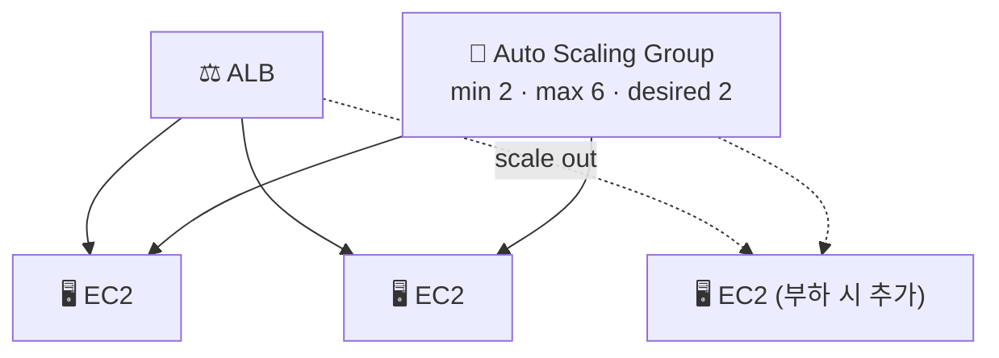

> **Auto Scaling** → 트래픽에 맞춰 **서버 수를 자동으로 늘리고 줄임**
>
> 바쁘면 인스턴스 추가, 한가하면 제거 → **성능 유지 + 비용 절감**
>
> 죽은 인스턴스 자동 교체 → **가용성**까지

---

## 한눈에

<Cards cols={3}>
<Card icon="↔️" title="수평 확장">
서버 **개수**를 늘림 (vs 사양 키우는 수직 확장)
</Card>
<Card icon="📄" title="Launch Template">
어떤 인스턴스를 띄울지 **템플릿**
</Card>
<Card icon="👥" title="ASG">
Auto Scaling Group · min/max/desired 관리
</Card>
<Card icon="🎯" title="스케일링 정책">
지표 기반 자동 조절 (CPU 등)
</Card>
<Card icon="❤️" title="헬스체크">
죽은 인스턴스 자동 교체
</Card>
<Card icon="⚖️" title="ALB 연동">
새 인스턴스 자동 등록·트래픽 분산
</Card>
</Cards>

---

## 1. 수평 확장 vs 수직 확장

<Compare>
<CompareCol title="⬆️ 수직 확장 (Scale Up)" subtitle="사양 키우기" color="amber">
- 인스턴스 타입 ⬆️ (more CPU/RAM)
- 한 대를 크게
- 한계 있음 · 교체 시 중단
- DB 같은 단일 노드에
</CompareCol>
<CompareCol title="↔️ 수평 확장 (Scale Out)" subtitle="개수 늘리기" color="green">
- 인스턴스 **대수** ⬆️
- 여러 대로 분산
- 사실상 무한 · 무중단
- **Auto Scaling의 방식**
</CompareCol>
</Compare>

<Note type="note" title="전제 조건">
- 수평 확장 → 어느 인스턴스가 받아도 동작해야 (**무상태**)
- 세션·상태 → 밖으로 (ElastiCache·DB) → [Sticky 세션 의존 ❌]
</Note>

---

## 2. 핵심 구성

- **Launch Template** → 띄울 인스턴스 정의 (AMI·타입·보안그룹·User Data)
- **Auto Scaling Group(ASG)** → 인스턴스 무리 관리
  - **Min / Max / Desired** → 최소·최대·희망 개수
- **ALB** → 새 인스턴스 자동 등록 → 트래픽 분산

<Note type="success" title="자가 치유">
- 인스턴스가 헬스체크 실패 → ASG가 **자동 종료 + 새로 생성**
- desired 개수 항상 유지 → 가용성 ⬆️
</Note>

---

## 3. 스케일링 정책

| 정책 | 방식 | 예 |
|------|------|------|
| **Target Tracking** | 지표 목표값 유지 | "평균 CPU 50% 유지" → 알아서 조절 |
| **Step Scaling** | 단계별 증감 | CPU 70%↑ → +2대, 90%↑ → +4대 |
| **Scheduled** | 시간 예약 | 매일 9시 +3대 (예측 트래픽) |

<Note type="pink" title="기본 추천">
- 대부분 **Target Tracking** (CPU·요청 수·ALB 지표 목표 유지)이 가장 단순·효과적
- 트래픽 패턴 예측되면 Scheduled 병행
</Note>

---

## 4. 실무 Tip

<Note type="pink" title="정리">
- 수평 확장 전제 → 앱 **무상태**(상태는 DB·[ElastiCache](/devops/aws/storage/elasticache))
- **Launch Template + ASG + ALB** 3종 세트가 표준
- 정책은 Target Tracking부터
- 컨테이너는 ECS Service Auto Scaling이 같은 역할 ([ECS](/devops/aws/compute/ecs))
- min을 2 이상 + 여러 AZ 분산 → 가용성
- 스케일 인 시 **갑작스러운 종료** 대비 → graceful shutdown·connection draining
</Note>
