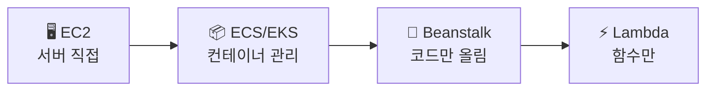
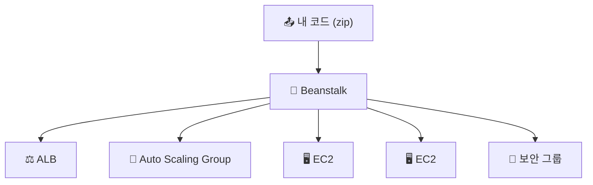

> **Elastic Beanstalk** → 코드만 올리면 **인프라를 자동 구성**해주는 PaaS
>
> EC2·ALB·Auto Scaling·보안그룹 → Beanstalk이 알아서 세팅
>
> 개발자는 **앱에만 집중**, 인프라는 AWS가 (단, 자원은 내 계정에)

---

## 한눈에

<Cards cols={3}>
<Card icon="📤" title="코드만 업로드">
zip/이미지 올리면 → 배포까지 자동
</Card>
<Card icon="🏗️" title="인프라 자동">
EC2·ALB·ASG·보안그룹 자동 프로비저닝
</Card>
<Card icon="🧩" title="플랫폼">
Node·Python·Java·Go·Docker 등 지원
</Card>
<Card icon="🌱" title="환경(Environment)">
web server / worker 환경 분리
</Card>
<Card icon="🔄" title="배포 정책">
All-at-once·Rolling·Blue/Green
</Card>
<Card icon="🎛️" title="제어 가능">
자동이지만 설정 오버라이드 가능
</Card>
</Cards>

---

## 1. 추상화 단계 — 어디까지 AWS가 해주나

- 왼쪽 → 제어 ⬆️·관리 부담 ⬆️ / 오른쪽 → 추상화 ⬆️·관리 부담 ⬇️
- **Beanstalk** → EC2와 Lambda 사이 · "인프라 자동 + 그래도 내 EC2"

<Note type="note" title="PaaS 위치">
- IaaS(EC2) → 내가 다 관리
- **PaaS(Beanstalk)** → 앱만, 인프라 자동
- FaaS(Lambda) → 함수만, 서버 개념 없음
</Note>

---

## 2. Beanstalk이 자동 구성하는 것

- 코드 업로드 한 번 → ALB·ASG·EC2·보안그룹·헬스체크까지 **세트로 구성**
- [Auto Scaling](/devops/aws/compute/autoscaling)·[ALB](/devops/aws/networking/load-balancer)를 직접 안 짜도 됨

---

## 3. 환경 · 버전 · 배포 정책

- **환경(Environment)** → 같은 앱의 실행 단위
  - **Web Server** 환경 → HTTP 요청 처리
  - **Worker** 환경 → SQS 큐 작업 처리(백그라운드)
- **버전** → 업로드한 코드 버전 관리 → 롤백 쉬움

| 배포 정책 | 방식 | 특징 |
|------|------|------|
| **All-at-once** | 한 번에 전체 교체 | 빠름 · 잠깐 다운 |
| **Rolling** | 일부씩 교체 | 무중단 · 혼재 버전 |
| **Rolling with batch** | 여분 띄우고 교체 | 용량 유지 |
| **Blue/Green** | 새 환경 띄우고 **URL 스왑** | 안전·즉시 롤백 |

<Note type="success" title="안전 배포">
- 무중단·즉시 롤백 필요 → **Blue/Green** (새 환경 띄운 뒤 swap)
</Note>

---

## 4. 언제 쓰나 / 한계

<Compare>
<CompareCol title="✅ 적합" subtitle="빠른 배포" color="green">
- 표준 웹앱 빠르게 배포
- 인프라 깊이 몰라도 운영
- 프로토타입·중소 서비스
</CompareCol>
<CompareCol title="⚠️ 한계" subtitle="제어 제약" color="amber">
- 세밀한 커스터마이징 → 답답
- 복잡한 MSA·특수 구성 → ECS/EKS·직접 구성
- "마법"이라 내부 디버깅 어려움
</CompareCol>
</Compare>

<Note type="pink" title="실무 정리">
- 빠르게 올리고 싶다 → Beanstalk
- 컨테이너 중심·세밀 제어 → [ECS](/devops/aws/compute/ecs)/EKS
- 이벤트성 → [Lambda](/devops/aws/compute/lambda)
- Beanstalk도 결국 EC2/ALB/ASG → 막히면 그 자원을 직접 들여다봄
- 배포는 Rolling/Blue-Green으로 무중단
</Note>
