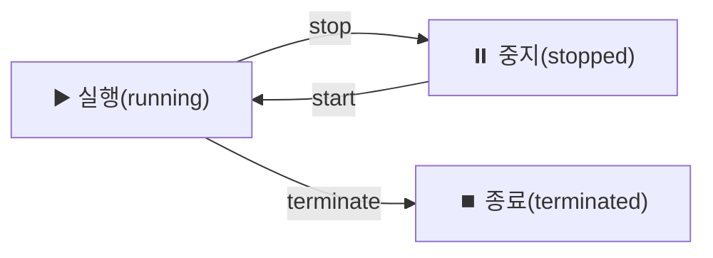

> **EC2(Elastic Compute Cloud)** → 클라우드에서 빌려 쓰는 **가상 서버**
>
> 필요할 때 띄우고, 안 쓰면 끄고 → **사용한 만큼 과금**
>
> 거의 모든 AWS 워크로드의 기본 컴퓨팅 단위

---

## 한눈에

<Cards cols={3}>
<Card icon="🖥️" title="인스턴스">
가상 서버 1대 = EC2 인스턴스
</Card>
<Card icon="💿" title="AMI">
인스턴스를 찍어내는 **이미지(OS+설정)**
</Card>
<Card icon="⚙️" title="인스턴스 타입">
CPU/메모리 조합 · 용도별 패밀리
</Card>
<Card icon="💰" title="구매 옵션">
On-Demand · Reserved · Spot · Savings Plans
</Card>
<Card icon="🔐" title="보안 그룹">
인스턴스 방화벽 (인바운드/아웃바운드)
</Card>
<Card icon="🔑" title="키 페어">
SSH 접속용 공개/개인 키
</Card>
</Cards>

---

## 1. EC2 기본 구성 요소

- **AMI(Amazon Machine Image)** → OS·런타임·설정이 담긴 템플릿 → 이걸로 인스턴스 생성
- **인스턴스 타입** → vCPU·메모리 조합 (예: `t3.micro`, `m5.large`)
- **키 페어** → SSH 접속 (공개키는 AWS, 개인키는 내가 보관)
- **User Data** → 부팅 시 1회 실행 스크립트 (초기 설치·설정 자동화)

<Note type="note" title="AMI 활용">
- 설정 끝난 인스턴스 → **커스텀 AMI**로 저장 → 동일 서버 빠르게 복제
- Auto Scaling·골든 이미지의 기반
</Note>

---

## 2. 인스턴스 타입 패밀리

- 이름 규칙 → `m5.large` = 패밀리(m) + 세대(5) + 크기(large)

| 패밀리 | 최적화 | 예 |
|------|------|------|
| **T / M** | 범용 (균형) | 웹서버·일반 앱 |
| **C** | 컴퓨팅 (CPU) | 연산·배치·게임서버 |
| **R / X** | 메모리 | 인메모리 DB·캐시 |
| **I / D** | 스토리지 (디스크 I/O) | 대용량 로컬 스토리지 |
| **P / G** | GPU | ML 학습·추론·그래픽 |

<Note type="success" title="T 패밀리 버스트">
- `t` 타입 → 평소 낮게 쓰다 순간 부하 시 **버스트(크레딧)**
- 변동 적은 가벼운 워크로드에 가성비 좋음
</Note>

---

## 3. 라이프사이클 — Stop vs Terminate

<Compare>
<CompareCol title="⏸️ Stop (중지)" subtitle="잠깐 끔" color="sky">
- 인스턴스 정지 · **EBS 루트 볼륨 유지**
- 다시 start 가능 (데이터 보존)
- 컴퓨팅 요금 X / EBS 저장 요금은 발생
</CompareCol>
<CompareCol title="⏹️ Terminate (종료)" subtitle="완전 삭제" color="amber">
- 인스턴스 삭제 · 기본 **EBS 루트도 삭제**
- 복구 불가 (다시 못 켬)
- 모든 요금 중단
</CompareCol>
</Compare>

<Note type="warning" title="데이터 주의">
- Terminate → 루트 볼륨 기본 삭제 → 중요한 데이터는 **별도 EBS·스냅샷·S3**에
- Instance Store(로컬 디스크) → **stop만 해도 데이터 소실** (휘발성)
</Note>

---

## 4. 구매 옵션 — 비용 최적화

| 옵션 | 방식 | 절감 | 적합 |
|------|------|------|------|
| **On-Demand** | 쓴 만큼 | 기준가 | 단기·예측 불가 |
| **Reserved / Savings Plans** | 1~3년 약정 | ~70% | 상시 워크로드 |
| **Spot** | 남는 용량 경매 | ~90% | 중단돼도 되는 작업 |
| **Dedicated** | 전용 하드웨어 | 비쌈 | 규정·라이선스 |

<Note type="pink" title="Spot 주의">
- Spot → 가장 저렴하지만 AWS가 **수시로 회수**(중단)
- 배치·CI·stateless 워커처럼 **죽어도 되는** 작업에
- 상시 서비스 → On-Demand + Reserved 조합
</Note>

---

## 5. 스토리지 & 네트워킹

- **EBS 루트 볼륨** → 대부분 EBS 기반 ([EBS](/devops/aws/storage/ebs-efs)) · stop해도 보존
- **Instance Store** → 인스턴스에 붙은 로컬 디스크 · 빠르지만 **휘발성**
- **ENI** → 가상 네트워크 인터페이스 (IP·보안그룹 연결)
- **보안 그룹** → 인스턴스 방화벽 ([Security Group](/devops/aws/networking/security)) · 인바운드/아웃바운드 규칙

<Note type="pink" title="실무 정리">
- AMI로 골든 이미지 → 동일 서버 빠르게 복제
- 상시 서버 비용 → Reserved/Savings Plans, 배치 → Spot
- 종료 시 데이터 보존 → 루트 외 별도 EBS·스냅샷·S3
- 단일 EC2 직접 관리보다 → **Auto Scaling + ALB** 조합이 운영 표준
</Note>
