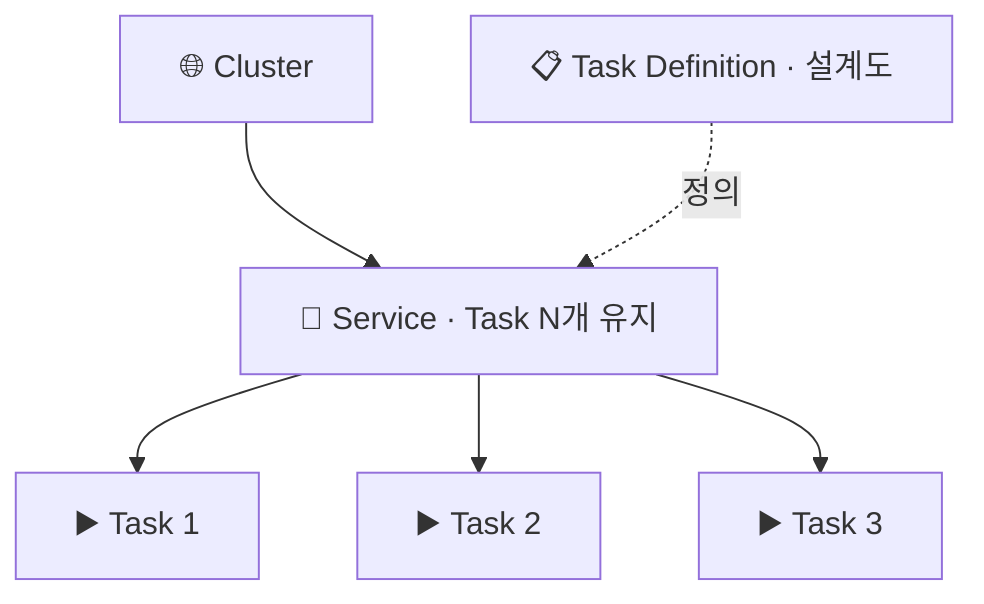
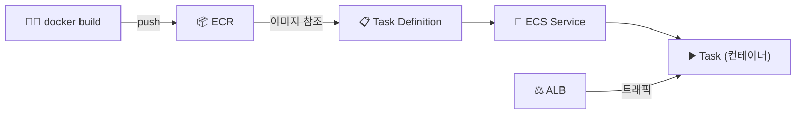

> **ECS** → 도커 **컨테이너를 실행·관리**하는 오케스트레이터
>
> **ECR** → 컨테이너 **이미지 저장소** (도커 레지스트리)
>
> **Fargate** → 서버 관리 없이 컨테이너만 띄우는 **서버리스 실행 환경**

---

## 한눈에

<Cards cols={3}>
<Card icon="📦" title="ECR">
컨테이너 이미지 저장소 (AWS판 도커 허브)
</Card>
<Card icon="📋" title="Task Definition">
컨테이너 **설계도** (이미지·CPU·메모리·포트·env)
</Card>
<Card icon="▶️" title="Task">
설계도로 실행된 컨테이너 **인스턴스**
</Card>
<Card icon="🔁" title="Service">
Task를 **N개 유지** + ALB 연동 + 오토스케일
</Card>
<Card icon="🖥️" title="EC2 vs Fargate">
직접 서버 관리 vs **서버리스**
</Card>
<Card icon="🌐" title="Cluster">
Task가 도는 논리적 묶음
</Card>
</Cards>

---

## 1. 왜 컨테이너 오케스트레이션

- 컨테이너 한두 개 → 직접 `docker run` 가능
- 수십~수백 개 → **배포·헬스체크·재시작·스케일·로드밸런싱** 수동 불가
- ECS → 이걸 **자동 관리**

<Note type="note" title="ECS vs EKS">
- **ECS** → AWS 자체 방식 · 단순 · AWS 통합 쉬움
- **EKS** → 관리형 쿠버네티스 · 표준·이식성 · 복잡
- AWS만 쓰고 단순하게 → ECS / 멀티클라우드·k8s 생태계 → EKS
</Note>

---

## 2. 핵심 구성 — 설계도 → 실행 → 유지

| 요소 | 역할 |
|------|------|
| **Task Definition** | 컨테이너 설계도 (이미지·CPU·메모리·포트·환경변수·볼륨) |
| **Task** | 설계도로 실제 실행된 컨테이너(들) |
| **Service** | Task를 원하는 개수로 **유지**·ALB 연동·오토스케일 |
| **Cluster** | Task/Service가 도는 논리적 자원 묶음 |

<Note type="success" title="Service가 핵심">
- Task가 죽으면 → Service가 **자동으로 새로 띄움**(원하는 개수 유지)
- ALB와 연동 → 트래픽 분산 + 헬스체크
</Note>

---

## 3. EC2 vs Fargate — 실행 방식

<Compare>
<CompareCol title="🖥️ EC2 런치 타입" subtitle="서버 직접 관리" color="amber">
- Task가 도는 **EC2 인스턴스를 내가 관리**
- 인스턴스 패치·스케일 직접
- 세밀한 제어·비용 최적화 여지
- GPU 등 특수 요구 가능
</CompareCol>
<CompareCol title="☁️ Fargate" subtitle="서버리스" color="green">
- **서버 관리 0** · Task만 정의하면 실행
- CPU/메모리 지정 → AWS가 알아서
- 운영 단순 · 빠른 시작
- 약간 비싸지만 운영 부담 ⬇️
</CompareCol>
</Compare>

<Note type="note" title="기본 선택">
- 운영 단순·빠르게 → **Fargate**
- 비용 최적화·특수 하드웨어·고정 대규모 → EC2 런치 타입
</Note>

---

## 4. ECR & 배포 흐름

- **ECR** → 빌드한 도커 이미지를 저장하는 레지스트리
- 흐름 → 빌드 → ECR 푸시 → Task Definition이 그 이미지 참조 → Service가 Task 실행 → ALB 라우팅

<Note type="success" title="CI/CD 연계">
- CodePipeline·GitHub Actions → 빌드→ECR 푸시→ECS 배포 자동화
- 새 이미지 → Task Definition 새 버전 → Service 롤링 업데이트
</Note>

---

## 5. 실무 Tip

<Note type="pink" title="정리">
- 시작은 **Fargate** (서버 관리 0)
- Service로 Task 개수 유지 + **ALB**([Load Balancer](/devops/aws/networking/load-balancer)) 연동
- 트래픽 변동 → Service Auto Scaling (Task 수 자동 조절)
- 이미지 → ECR + CI/CD로 빌드·배포 자동화
- 영속 데이터 → 컨테이너 밖 (RDS·[EFS](/devops/aws/storage/ebs-efs)·S3)
- 단순·AWS 통합 → ECS / k8s 생태계 필요 → EKS
</Note>
