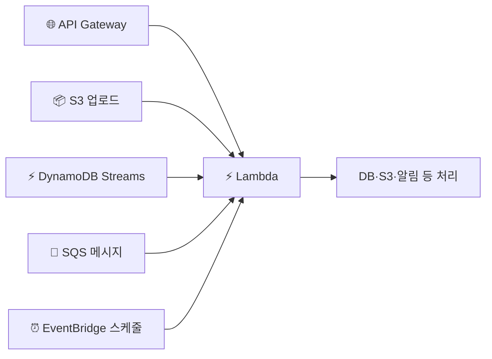
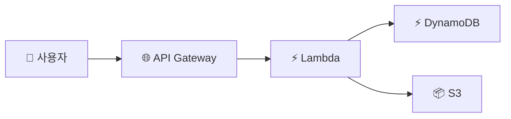

> **Lambda** → 서버 없이 **함수(코드)만 올리면 실행**되는 서버리스 컴퓨팅
>
> **이벤트가 발생할 때만** 돌고 → **실행 시간만큼만** 과금
>
> 서버 프로비저닝·패치·스케일 → 전부 AWS가

---

## 한눈에

<Cards cols={3}>
<Card icon="⚡" title="이벤트 기반">
요청·파일 업로드·메시지 등 **트리거**로 실행
</Card>
<Card icon="💸" title="사용량 과금">
실행 시간 × 메모리 · **안 돌면 0원**
</Card>
<Card icon="📈" title="자동 확장">
동시 요청 수만큼 인스턴스 자동 증가
</Card>
<Card icon="🧊" title="콜드 스타트">
오랜만에 호출 → 첫 실행 지연
</Card>
<Card icon="⏱️" title="실행 제한">
최대 15분 · 임시 디스크·메모리 한도
</Card>
<Card icon="🔗" title="트리거">
API GW·S3·DynamoDB·SQS·EventBridge…
</Card>
</Cards>

---

## 1. 서버리스란 — EC2/ECS와 뭐가 다른가

<Compare>
<CompareCol title="🖥️ EC2 / ECS" subtitle="서버/컨테이너 상주" color="amber">
- 인스턴스가 **항상 떠 있음**
- 요청 없어도 과금
- 스케일·패치 신경 써야
- 상시·장시간 워크로드
</CompareCol>
<CompareCol title="⚡ Lambda" subtitle="필요할 때만" color="green">
- **이벤트 발생 시에만** 실행
- 안 돌면 **0원**
- 스케일·인프라 0 관리
- 짧은·간헐·이벤트성 작업
</CompareCol>
</Compare>

<Note type="note" title="언제 Lambda">
- 이미지 업로드 후처리 · API 백엔드 · 스케줄 작업 · 스트림 처리
- 길고 무거운 연산·상시 고트래픽 → EC2/ECS가 나을 수 있음
</Note>

---

## 2. 이벤트 기반 실행 — 트리거

- Lambda는 스스로 안 돎 → **무언가 트리거**해야 실행

| 트리거 | 예시 |
|------|------|
| **API Gateway** | HTTP 요청 → 함수 (REST 백엔드) |
| **S3** | 파일 업로드 → 썸네일 생성 |
| **DynamoDB Streams** | 데이터 변경 → 후처리 |
| **SQS / SNS** | 메시지 → 비동기 처리 |
| **EventBridge** | 스케줄(cron)·이벤트 |

---

## 3. 콜드 스타트 & 동시성

- **콜드 스타트** → 한동안 호출 없다가 실행 → 환경 새로 띄우느라 **첫 응답 지연**
- 자주 호출되면 → 환경 재사용(웜) → 빠름
- **동시성** → 동시 요청 N개 → Lambda 인스턴스 N개 자동 생성

<Note type="warning" title="콜드 스타트 완화">
- Provisioned Concurrency → 미리 워밍 (지연 민감 API)
- 런타임 가볍게·패키지 작게 → 콜드 스타트 ⬇️
- VPC 연결 Lambda → 예전엔 더 느렸으나 개선됨
</Note>

---

## 4. 실행 제약

| 항목 | 한도 |
|------|------|
| 최대 실행 시간 | **15분** |
| 메모리 | 128MB ~ 10GB (CPU도 비례 ⬆️) |
| 임시 디스크 `/tmp` | 512MB ~ 10GB |
| 배포 패키지 | 압축 50MB / 압축해제 250MB (컨테이너 이미지는 10GB) |

<Note type="danger" title="한계 인지">
- 15분 넘는 작업 → Lambda ❌ → ECS/Batch/Step Functions로 분할
- 상태는 함수 밖에 (DB·S3) → Lambda는 **무상태(stateless)**
</Note>

---

## 5. 서버리스 아키텍처

<Note type="pink" title="실무 정리">
- API 백엔드 → **API Gateway + Lambda + DynamoDB** (대표 서버리스 조합)
- 비동기·후처리 → S3/SQS/Streams 트리거
- 지연 민감 → Provisioned Concurrency로 콜드 스타트 완화
- 무상태 유지 → 상태는 DB·S3·[ElastiCache](/devops/aws/storage/elasticache)
- 15분·무거운 연산 → ECS/Batch로
</Note>
