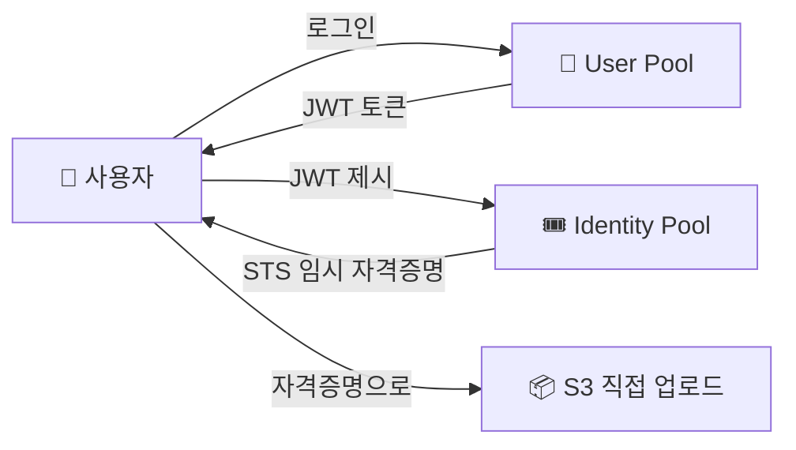

> **Cognito** → **앱 사용자(end user)** 의 회원가입·로그인을 관리하는 서비스
>
> IAM은 **AWS 리소스 접근**(개발자·서비스) / Cognito는 **내 앱의 고객**
>
> 핵심 → User Pool(인증) + Identity Pool(AWS 자원 접근)

---

## 한눈에

<Cards cols={3}>
<Card icon="🪪" title="User Pool">
앱 사용자 **디렉터리** · 회원가입·로그인·JWT 발급
</Card>
<Card icon="🎟️" title="Identity Pool">
인증된 사용자에게 **AWS 임시 자격증명** 부여
</Card>
<Card icon="🔑" title="JWT 토큰">
ID / Access / Refresh 토큰
</Card>
<Card icon="🌐" title="소셜 로그인">
구글·애플·페북·OIDC·SAML 연동
</Card>
<Card icon="🛡️" title="MFA">
다단계 인증·비밀번호 정책
</Card>
<Card icon="↔️" title="IAM과 구분">
IAM=개발자/서비스 · Cognito=앱 고객
</Card>
</Cards>

---

## 1. IAM vs Cognito — 누구를 위한 인증

<Compare>
<CompareCol title="🔧 IAM" subtitle="AWS 리소스 접근" color="sky">
- 개발자·운영자·서비스(EC2 등)
- S3·EC2 등 **AWS 자원** 권한
- 수: 수십~수백 (계정 내부)
</CompareCol>
<CompareCol title="🧑 Cognito" subtitle="앱 사용자" color="pink">
- 내 서비스의 **고객(end user)**
- 회원가입·로그인·프로필
- 수: 수천~수백만 (외부)
</CompareCol>
</Compare>

<Note type="note" title="헷갈리지 말 것">
- "EC2가 S3 접근" → IAM Role
- "우리 앱 회원 로그인" → Cognito User Pool
</Note>

---

## 2. User Pool vs Identity Pool

| 구분 | User Pool | Identity Pool |
|------|-----------|---------------|
| 역할 | **인증**(누구인가) | **인가**(AWS 자원 접근) |
| 결과 | JWT 토큰 | STS 임시 자격증명 |
| 용도 | 로그인·회원관리 | 로그인한 사용자가 S3 업로드 등 |



<Note type="success" title="조합">
- 로그인만 필요 → **User Pool**만 (JWT로 내 API 인증)
- 사용자가 AWS 자원 직접 접근 → User Pool + **Identity Pool**
</Note>

---

## 3. JWT 토큰

- User Pool 로그인 성공 → **3종 토큰** 발급:

| 토큰 | 용도 |
|------|------|
| **ID Token** | 사용자 정보(이름·이메일) |
| **Access Token** | API 접근 권한 |
| **Refresh Token** | 만료된 토큰 갱신 |

- 백엔드는 이 JWT를 **검증**해 사용자 식별

```python
# FastAPI에서 Cognito JWT 검증 (개념 예시)
import jwt
# Cognito 공개키(JWKS)로 서명 검증 → 토큰의 sub(사용자 ID), email 추출
claims = jwt.decode(access_token, public_key, algorithms=["RS256"],
                    audience=APP_CLIENT_ID)
user_id = claims["sub"]
```

---

## 4. 소셜 / 페더레이션 로그인

- User Pool에 **외부 IdP** 연결 → 구글·애플·페북·OIDC·SAML 로그인
- 사용자는 기존 계정으로 로그인 → Cognito가 통합 관리

<Note type="pink" title="실무 정리">
- 앱 회원 인증 → **Cognito User Pool** (직접 인증 시스템 안 만들어도 됨)
- 백엔드는 JWT 검증만 ([FastAPI auth]와 연계)
- 사용자가 S3 직접 업로드 등 → Identity Pool로 임시 자격증명
- 소셜 로그인 → User Pool IdP 연동
- MFA·비밀번호 정책·이메일 인증 내장 → 보안 기능 직접 구현 불필요
</Note>
