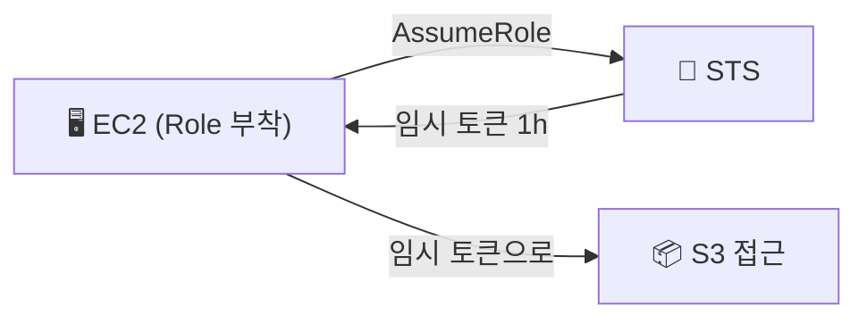

> **IAM(Identity and Access Management)** → **누가 무엇을 할 수 있나**를 관리
>
> 모든 AWS 권한의 기반 → User·Role에 **Policy(JSON)** 를 붙여 제어
>
> 원칙 → **최소 권한(least privilege)** · 필요한 것만 허용

---

## 한눈에

<Cards cols={3}>
<Card icon="👤" title="User">
사람·앱에 대응하는 **장기 자격증명**
</Card>
<Card icon="👥" title="Group">
User 묶음 → 정책 일괄 부여
</Card>
<Card icon="🎭" title="Role">
**임시 자격증명** · 필요 시 빌려 씀(AssumeRole)
</Card>
<Card icon="📜" title="Policy">
권한 정의 **JSON** (Effect·Action·Resource)
</Card>
<Card icon="🔑" title="자격증명">
User=Access Key / Role=임시 토큰(STS)
</Card>
<Card icon="🛡️" title="최소 권한">
필요한 것만 허용 (기본은 전부 거부)
</Card>
</Cards>

---

## 1. 네 가지 요소

| 요소 | 무엇 | 예 |
|------|------|------|
| **User** | 사람/앱 1개에 대응 | `dev-yoona` |
| **Group** | User 묶음 | `Developers`, `Admins` |
| **Role** | 임시로 빌려 쓰는 권한 | `ec2-s3-read-role` |
| **Policy** | 권한 규칙(JSON) | `AmazonS3ReadOnlyAccess` |

- **기본은 전부 거부(implicit deny)** → Policy로 명시적 허용해야 가능
- 명시적 **Deny**는 어떤 Allow보다 우선

---

## 2. 정책(Policy) JSON 구조

- 핵심 4요소 → **Effect**(허용/거부) · **Action**(무슨 작업) · **Resource**(어디에) · **Condition**(조건)

```json
{
  "Version": "2012-10-17",
  "Statement": [
    {
      "Effect": "Allow",
      "Action": ["s3:GetObject", "s3:ListBucket"],
      "Resource": [
        "arn:aws:s3:::my-bucket",
        "arn:aws:s3:::my-bucket/*"
      ]
    }
  ]
}
```

- 위 정책 → `my-bucket`의 객체 **읽기·목록만** 허용 (쓰기·삭제 ❌)

조건(Condition) 예시 — 특정 IP에서만:

```json
{
  "Effect": "Allow",
  "Action": "s3:*",
  "Resource": "arn:aws:s3:::my-bucket/*",
  "Condition": { "IpAddress": { "aws:SourceIp": "203.0.113.0/24" } }
}
```

<Note type="note" title="Managed vs Inline">
- **Managed Policy** → 재사용 가능한 독립 정책 (AWS 제공 or 커스텀)
- **Inline Policy** → 특정 User/Role에 박아 넣은 1회용
- 보통 **Managed** 권장 (재사용·관리 쉬움)
</Note>

---

## 3. User vs Role — 가장 중요한 구분

<Compare>
<CompareCol title="👤 User" subtitle="장기 자격증명" color="amber">
- Access Key (장기) 보유
- 사람·고정 앱에
- 키 유출 위험 → 주기적 교체
- 예: 콘솔 로그인, CI 고정 키
</CompareCol>
<CompareCol title="🎭 Role" subtitle="임시 자격증명" color="green">
- 키 없음 → **STS 임시 토큰**(분~시간)
- 필요할 때 **AssumeRole**로 빌림
- 유출 위험 ⬇️ (만료됨)
- 예: EC2·Lambda·교차 계정
</CompareCol>
</Compare>

<Note type="success" title="Role을 선호하라">
- EC2/Lambda가 S3 접근 → **키 박지 말고 Role 부여**
- 코드에 Access Key 하드코딩 ❌ → 사고 1순위
</Note>

---

## 4. AssumeRole — 권한을 빌리는 흐름

- Role은 **신뢰 정책(누가 빌릴 수 있나)** + **권한 정책(뭘 할 수 있나)** 으로 구성
- EC2에 Role 붙이면 → 인스턴스가 자동으로 임시 토큰 받아 사용



CLI로 직접 빌리는 예 (교차 계정 등):

```bash
aws sts assume-role \
  --role-arn arn:aws:iam::123456789012:role/ec2-s3-read-role \
  --role-session-name my-session
# → AccessKeyId / SecretAccessKey / SessionToken (임시) 반환
```

EC2에 Role 붙이는 예:

```bash
aws ec2 associate-iam-instance-profile \
  --instance-id i-0abc123 \
  --iam-instance-profile Name=ec2-s3-read-profile
```

---

## 5. 최소 권한 원칙

<Note type="danger" title="피해야 할 것">
- `"Action": "*"`, `"Resource": "*"` (관리자 권한 남발) ❌
- 코드/깃에 Access Key 커밋 ❌ → 노출 즉시 악용
- 루트 계정 일상 사용 ❌ → MFA 걸고 잠가두기
</Note>

<Note type="pink" title="실무 정리">
- 필요한 **Action·Resource만** 좁게 허용 (least privilege)
- 사람 → User+Group / 서비스(EC2·Lambda) → **Role**
- 교차 계정·임시 작업 → AssumeRole(STS)
- AWS Managed Policy로 시작 → 필요 시 커스텀
- IAM Access Analyzer로 과한 권한 점검
</Note>
