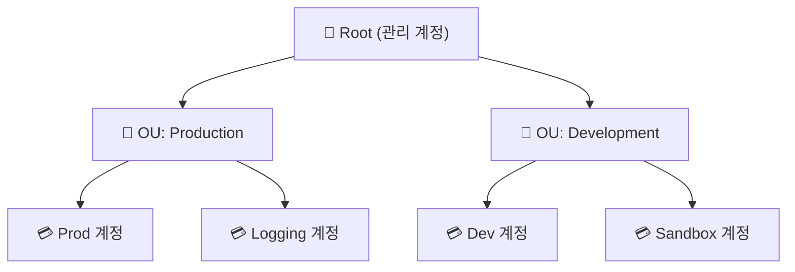

> **AWS Organizations** → 여러 AWS 계정을 **하나로 묶어 관리**
>
> **SCP(Service Control Policy)** → 계정 전체에 거는 **권한 상한선(가드레일)**
>
> 큰 조직 → 계정을 용도별로 쪼개고, 위에서 통제

---

## 한눈에

<Cards cols={3}>
<Card icon="🏢" title="Organization">
여러 계정을 묶는 최상위 단위
</Card>
<Card icon="📁" title="OU">
Organizational Unit · 계정 그룹(부서·환경)
</Card>
<Card icon="🚧" title="SCP">
계정의 **권한 상한선** (가드레일)
</Card>
<Card icon="💳" title="통합 결제">
계정별 비용 → 한 곳에서 + 볼륨 할인
</Card>
<Card icon="🌱" title="계정 분리">
Prod/Dev/Sandbox 등 격리
</Card>
<Card icon="🔒" title="격리">
계정 = 가장 강력한 격리 경계
</Card>
</Cards>

---

## 1. 왜 다중 계정

- 한 계정에 전부 넣으면 → 권한·비용·장애 **격리 안 됨**
- 계정을 용도별로 쪼개면 → **폭발 반경(blast radius) 축소**

| 계정 분리 예 | 목적 |
|------|------|
| **Prod / Dev / Staging** | 환경 격리 (실수 전파 차단) |
| **Security / Logging** | 감사 로그 별도 보관 |
| **Sandbox** | 자유 실험 (망쳐도 OK) |

<Note type="note" title="계정 = 격리 경계">
- IAM 정책보다 강력한 격리 → **계정 자체를 나누는 것**
- Prod 계정과 Dev 계정 분리 → Dev 사고가 Prod에 영향 0
</Note>

---

## 2. 구조 — Organization · OU · Account



- **Root** → 조직 최상위 (관리 계정)
- **OU** → 계정 그룹 (환경·부서별) → 정책을 OU 단위로 일괄 적용
- **Account** → 실제 자원이 사는 계정

---

## 3. SCP — 권한 상한선(가드레일)

- SCP는 **권한을 주는 게 아니라** 가능한 권한의 **상한**을 정함
- 최종 권한 = **SCP ∩ IAM 정책** (둘 다 허용해야 가능)

```json
{
  "Version": "2012-10-17",
  "Statement": [{
    "Sid": "DenyOutsideSeoul",
    "Effect": "Deny",
    "Action": "*",
    "Resource": "*",
    "Condition": {
      "StringNotEquals": { "aws:RequestedRegion": "ap-northeast-2" }
    }
  }]
}
```

- 위 SCP → 서울 리전 외 **모든 작업 차단** (계정 내 어떤 IAM도 못 넘음)

<Note type="warning" title="SCP의 함정">
- SCP는 **관리 계정엔 적용 안 됨** → 관리 계정에 자원 두지 말 것
- SCP가 Deny면 IAM에서 Allow해도 **불가** (상한 우선)
- 너무 빡빡하면 정상 작업도 막힘 → 단계적 적용
</Note>

---

## 4. 통합 결제 & 활용

- **통합 결제(Consolidated Billing)** → 모든 계정 비용 한 곳에 + **볼륨 할인** 공유
- 계정 자동 생성·베이스라인 → **Control Tower**(랜딩 존)로 표준화

<Note type="pink" title="실무 정리">
- 규모 커지면 → 단일 계정 ❌ → **다중 계정 + Organizations**
- 환경별(Prod/Dev) 계정 분리 → 격리·blast radius ⬇️
- OU 단위 **SCP로 가드레일** (리전 제한·위험 서비스 차단)
- 로그·보안 계정 별도 → 감사 추적 보존
- 표준화·자동화 → Control Tower
</Note>
