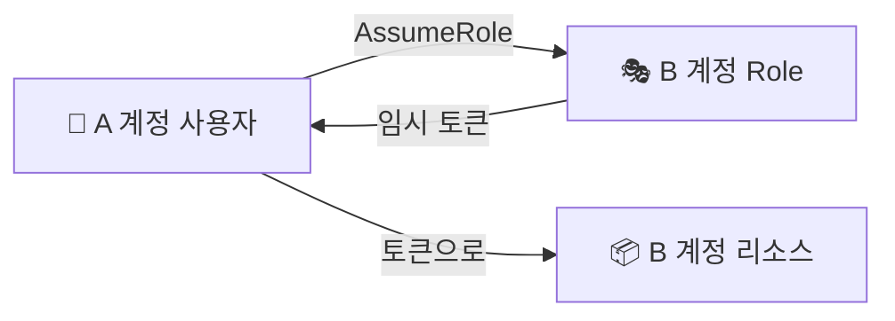

> **STS(Security Token Service)** → **임시 자격증명**을 발급하는 서비스
>
> 장기 키 대신 → **만료되는 토큰**(분~시간) → 유출돼도 곧 무효
>
> AssumeRole·교차 계정·페더레이션의 엔진

---

## 한눈에

<Cards cols={3}>
<Card icon="⏳" title="임시 토큰">
AccessKey + Secret + **SessionToken** · 만료됨
</Card>
<Card icon="🎭" title="AssumeRole">
Role을 빌려 그 권한으로 행동
</Card>
<Card icon="🔁" title="교차 계정">
A 계정이 B 계정 Role 빌리기
</Card>
<Card icon="🤝" title="신뢰 정책">
"누가 이 Role을 빌릴 수 있나" 정의
</Card>
<Card icon="🌐" title="페더레이션">
외부 ID(구글·GitHub·SAML)로 AWS 접근
</Card>
<Card icon="🔐" title="유출 안전">
만료 토큰 → 장기 키보다 위험 ⬇️
</Card>
</Cards>

---

## 1. 왜 임시 자격증명

- 장기 Access Key → 유출되면 **무기한 악용**
- STS 임시 토큰 → 수 분~수 시간 후 **자동 만료** → 피해 최소화
- 토큰 3종 → `AccessKeyId` + `SecretAccessKey` + **`SessionToken`**

```bash
aws sts get-caller-identity   # 지금 내가 누구로 인증됐는지 확인
```

---

## 2. Role의 두 정책 — 신뢰 vs 권한

- Role은 **두 정책**을 가짐:

| 정책 | 질문 | 예 |
|------|------|------|
| **신뢰 정책(Trust Policy)** | **누가** 이 Role을 빌릴 수 있나 | EC2 서비스, 특정 계정 |
| **권한 정책(Permission Policy)** | 빌린 뒤 **뭘** 할 수 있나 | S3 읽기 |

신뢰 정책 예 — EC2가 이 Role을 쓰도록 허용:

```json
{
  "Version": "2012-10-17",
  "Statement": [{
    "Effect": "Allow",
    "Principal": { "Service": "ec2.amazonaws.com" },
    "Action": "sts:AssumeRole"
  }]
}
```

---

## 3. 교차 계정 접근

- A 계정 사용자가 B 계정 리소스 접근 → B의 Role을 **AssumeRole**



B 계정 Role의 신뢰 정책 — A 계정을 신뢰:

```json
{
  "Effect": "Allow",
  "Principal": { "AWS": "arn:aws:iam::111111111111:root" },
  "Action": "sts:AssumeRole"
}
```

빌리기:

```bash
aws sts assume-role \
  --role-arn arn:aws:iam::222222222222:role/cross-account-read \
  --role-session-name yoona-session
```

---

## 4. 페더레이션 — 외부 ID로 AWS 접근

- 키 없이 **외부 신원**으로 임시 권한 받기
- **OIDC** → GitHub Actions·Kubernetes(IRSA)가 AWS 키 없이 접근
- **SAML** → 사내 IdP(Okta 등) 연동

<Note type="success" title="GitHub Actions OIDC 예">
- 예전 → GitHub Secret에 AWS 장기 키 저장(위험)
- 지금 → OIDC로 **Role을 AssumeRole** → 키 0 · 토큰만 잠깐
- `assume-role-with-web-identity`로 깃허브 토큰 → AWS 임시 토큰 교환
</Note>

---

## 5. 실무 Tip

<Note type="pink" title="정리">
- 어디서든 **장기 키보다 STS 임시 토큰** 우선
- EC2·Lambda → Role 부착 (자동 STS) · 코드에 키 ❌
- 교차 계정 → 상대 Role 신뢰 정책에 내 계정 등록 → AssumeRole
- CI(GitHub Actions)·EKS Pod → **OIDC 페더레이션**으로 키리스(keyless)
- `aws sts get-caller-identity`로 현재 신원 디버깅
</Note>
