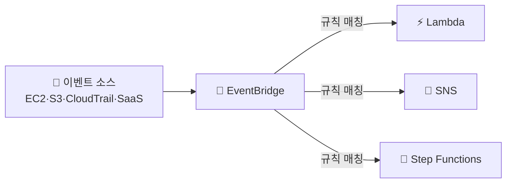

> **CloudTrail** → **누가·언제·무엇을** 했는지 기록하는 **감사(audit) 로그**
>
> **EventBridge** → AWS 이벤트를 받아 **자동 반응**시키는 이벤트 버스
>
> CloudWatch가 "상태(지표·로그)"라면, 이쪽은 "**행위·이벤트**"

---

## 한눈에

<Cards cols={3}>
<Card icon="🕵️" title="CloudTrail">
모든 API 호출 기록 (누가 뭘 했나)
</Card>
<Card icon="🔎" title="감사/포렌식">
"누가 이 버킷 지웠어?" 추적
</Card>
<Card icon="🚌" title="EventBridge">
이벤트를 규칙으로 라우팅하는 버스
</Card>
<Card icon="⚡" title="이벤트 자동화">
이벤트 → Lambda·SNS·Step Functions
</Card>
<Card icon="⏰" title="스케줄">
cron 이벤트로 정기 작업
</Card>
<Card icon="🔗" title="SaaS 연동">
외부 SaaS 이벤트도 수신
</Card>
</Cards>

---

## 1. CloudWatch vs CloudTrail vs EventBridge

| 서비스 | 답하는 질문 | 데이터 |
|------|------|------|
| **CloudWatch** | 잘 돌고 있나? | 지표·로그 (상태) |
| **CloudTrail** | 누가 무엇을 했나? | API 호출 기록 (감사) |
| **EventBridge** | 이 일이 생기면 뭘 할까? | 이벤트 라우팅 (반응) |

<Note type="note" title="헷갈리지 말기">
- "CPU 높음" → CloudWatch
- "누가 RDS 삭제함" → CloudTrail
- "인스턴스 종료되면 슬랙 알림" → EventBridge
</Note>

---

## 2. CloudTrail — API 감사 로그

- AWS의 **모든 API 호출**(콘솔·CLI·SDK)을 기록
- 기록 내용 → 누가(IAM 주체)·언제·어디서(IP)·무엇을(액션)·결과
- 로그를 **S3에 보존** → 장기 감사·규정 준수

CloudTrail 이벤트(JSON) 일부 예:

```json
{
  "eventTime": "2026-06-17T01:23:45Z",
  "eventName": "DeleteBucket",
  "userIdentity": { "type": "IAMUser", "userName": "dev-yoona" },
  "sourceIPAddress": "203.0.113.10",
  "requestParameters": { "bucketName": "prod-logs" }
}
```

<Note type="danger" title="감사의 핵심">
- 사고 시 "누가 언제 무엇을" → CloudTrail로 추적
- 멀티 계정 → [Organizations](/devops/aws/iam/organizations) 조직 트레일로 **전 계정 통합 기록**
- 로그 자체 변조 방지 → 별도 보안 계정 S3에 저장
</Note>

---

## 3. EventBridge — 이벤트 기반 자동화

- AWS 이벤트(상태 변화·CloudTrail 이벤트 등)를 **규칙(Rule)** 으로 필터 → **타깃**으로 라우팅



이벤트 패턴 규칙 예 — EC2 종료 감지:

```json
{
  "source": ["aws.ec2"],
  "detail-type": ["EC2 Instance State-change Notification"],
  "detail": { "state": ["terminated"] }
}
```

- 위 규칙 → EC2가 terminated 되면 매칭 → 타깃(Lambda·SNS) 실행

**스케줄 규칙** 예 (cron) — 매일 새벽 2시:

```
cron(0 17 * * ? *)   # UTC 17시 = KST 02시
```

<Note type="success" title="활용">
- 인스턴스 종료·보안 그룹 변경 → 즉시 슬랙 알림
- 정기 배치 → 스케줄 규칙으로 Lambda 트리거 ([Lambda](/devops/aws/compute/lambda))
- CloudTrail 이벤트 → EventBridge로 실시간 보안 대응
</Note>

---

## 4. 실무 Tip

<Note type="pink" title="정리">
- 감사·규정 준수 → **CloudTrail 항상 켜두기** + S3 장기 보존
- 멀티 계정 → 조직 트레일로 통합
- 이벤트 자동화 → **EventBridge 규칙**(패턴 매칭 → 타깃)
- 정기 작업 → EventBridge 스케줄(cron) + Lambda
- 보안 대응: CloudTrail → EventBridge → Lambda 자동 차단/알림 파이프라인
</Note>
