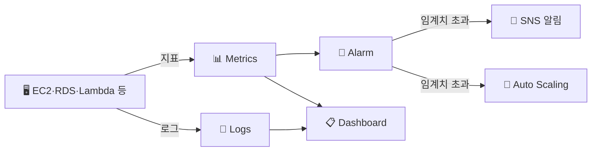
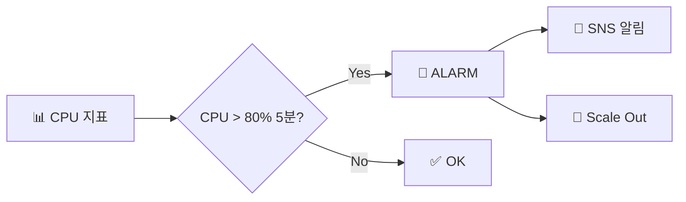

> **CloudWatch** → AWS의 **관측(observability) 허브** — 지표·로그·알람
>
> "지금 잘 돌고 있나? 문제 생기면 어떻게 아나?" 에 답하는 서비스
>
> 세 기둥 → **Metrics**(수치) · **Logs**(기록) · **Alarms**(임계치 알림)

---

## 한눈에

<Cards cols={3}>
<Card icon="📊" title="Metrics">
시간별 수치 (CPU·요청 수·지연 등)
</Card>
<Card icon="📜" title="Logs">
애플리케이션·시스템 로그 수집·검색
</Card>
<Card icon="🚨" title="Alarms">
임계치 넘으면 알림·자동 조치
</Card>
<Card icon="📋" title="Dashboard">
지표·로그를 한 화면에 시각화
</Card>
<Card icon="🤖" title="커스텀 메트릭">
앱이 직접 보내는 비즈니스 지표
</Card>
<Card icon="🔔" title="액션">
SNS 알림 · Auto Scaling 트리거
</Card>
</Cards>

---

## 1. 세 기둥 — Metrics · Logs · Alarms



---

## 2. Metrics — 수치 지표

- **네임스페이스** → 지표 묶음 (`AWS/EC2`, `AWS/RDS`)
- **디멘션** → 지표를 구분하는 키 (예: `InstanceId=i-0abc`)
- **기간(Period)** + **통계**(Average·Sum·Max…)로 조회
- 기본 지표(EC2 CPU 등) + **커스텀 메트릭**(앱이 직접 전송)

커스텀 메트릭 전송 예 (CLI):

```bash
aws cloudwatch put-metric-data \
  --namespace "MyApp" \
  --metric-name "OrdersCreated" \
  --value 1 \
  --dimensions Service=checkout
```

<Note type="note" title="커스텀 메트릭 활용">
- "주문 수", "결제 실패율" 같은 **비즈니스 지표**도 메트릭으로
- → 그 위에 알람·대시보드 구성 가능
</Note>

---

## 3. Logs — 로그 수집·검색

- **Log Group** → 로그 묶음 (예: `/ecs/checkout`)
- **Log Stream** → 그 안의 개별 로그 흐름 (인스턴스·컨테이너별)
- EC2 → **CloudWatch Agent** 설치해 로그 전송 / Lambda·ECS → 자동 연동
- **Logs Insights** → 로그를 SQL 비슷한 쿼리로 분석

Logs Insights 쿼리 예 — 에러 로그 상위:

```sql
fields @timestamp, @message
| filter @message like /ERROR/
| sort @timestamp desc
| limit 20
```

---

## 4. Alarms — 임계치 알림·자동 조치

- 메트릭이 **임계치**를 넘으면 → 알림·액션
- 상태 3가지: **OK** · **ALARM** · **INSUFFICIENT_DATA**(데이터 부족)
- 액션 → SNS(이메일·Slack) · Auto Scaling · EC2 재시작



알람 생성 예 (CLI):

```bash
aws cloudwatch put-metric-alarm \
  --alarm-name "high-cpu" \
  --namespace "AWS/EC2" --metric-name "CPUUtilization" \
  --dimensions Name=InstanceId,Value=i-0abc \
  --statistic Average --period 300 --evaluation-periods 2 \
  --threshold 80 --comparison-operator GreaterThanThreshold \
  --alarm-actions arn:aws:sns:ap-northeast-2:111111111111:ops-alerts
```

<Note type="warning" title="알람 설계 주의">
- **evaluation-periods** → 일시적 스파이크에 안 울리게 (예: 5분 × 2회 연속)
- 너무 민감 → 알람 피로(alert fatigue) · 너무 둔감 → 장애 놓침
</Note>

---

## 5. Dashboard & 실무 Tip

- **Dashboard** → 핵심 지표·로그·알람을 한 화면에 → 운영 상황판

<Note type="pink" title="실무 정리">
- 기본 지표 + **커스텀 메트릭**(비즈니스 지표)로 관측 범위 확장
- 로그는 Log Group 단위 정리 + **Logs Insights**로 분석
- 알람 → SNS로 Slack/이메일, [Auto Scaling](/devops/aws/compute/autoscaling) 트리거
- evaluation-periods로 노이즈 억제
- 분산 추적(요청 흐름)은 CloudWatch만으론 부족 → X-Ray 병행
- 비용 → 커스텀 메트릭·로그 보존 기간 과하면 요금 ⬆️ → 보존 정책 설정
</Note>
