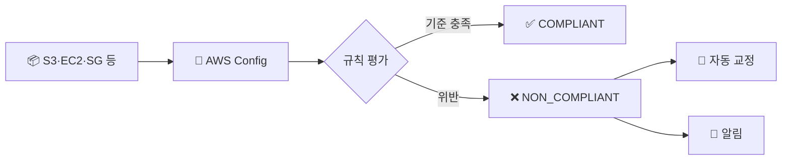

> **AWS Config** → 리소스 **구성(설정)의 상태와 변경 이력**을 추적·평가
>
> "지금 설정이 규정에 맞나? 언제 누가 바꿨나?" 에 답
>
> CloudTrail이 "API 행위"라면, Config는 "**리소스 구성 상태**"

---

## 한눈에

<Cards cols={3}>
<Card icon="📐" title="구성 추적">
리소스 설정의 현재 상태 기록
</Card>
<Card icon="🕰️" title="변경 이력">
설정이 시간에 따라 어떻게 바뀌었나
</Card>
<Card icon="✅" title="Config Rules">
규정 준수 자동 평가 (compliant 여부)
</Card>
<Card icon="🔧" title="자동 교정">
위반 시 자동 수정(remediation)
</Card>
<Card icon="📋" title="Conformance Pack">
규칙 묶음으로 일괄 적용
</Card>
<Card icon="🛡️" title="Audit Manager">
감사 증거 자동 수집·리포트
</Card>
</Cards>

---

## 1. CloudTrail vs Config

| | CloudTrail | Config |
|--|-----------|--------|
| 추적 대상 | **API 호출**(행위) | **리소스 구성**(상태) |
| 질문 | 누가 무엇을 했나 | 지금 설정이 어떤가·맞나 |
| 예 | "누가 SG 수정함" | "공개된 S3 버킷이 있나" |

<Note type="note" title="상호 보완">
- CloudTrail → 행위 추적 / Config → 상태·준수 평가
- 보통 **함께** 사용 (행위 + 결과 상태)
</Note>

---

## 2. Config Rules — 규정 준수 평가

- 리소스가 **원하는 설정 기준**을 만족하는지 자동 평가 → `COMPLIANT` / `NON_COMPLIANT`
- AWS 관리형 규칙(수백 개) + 커스텀(Lambda) 규칙



대표 관리형 규칙 예:
- `s3-bucket-public-read-prohibited` → 공개 읽기 버킷 금지
- `encrypted-volumes` → EBS 암호화 필수
- `restricted-ssh` → SSH(22) 전체 개방 금지

---

## 3. 자동 교정 (Remediation)

- 위반 발견 → **자동으로 수정** (SSM Automation 연동)

예시 시나리오:

```
규칙: s3-bucket-public-read-prohibited
위반: prod-logs 버킷이 퍼블릭
교정: 자동으로 Block Public Access 적용 → COMPLIANT 복귀
```

<Note type="success" title="Conformance Pack">
- 여러 규칙을 **묶음(팩)** 으로 한 번에 배포
- 예: "CIS 벤치마크 팩", "PCI-DSS 팩" → 규정 세트 일괄 적용
</Note>

---

## 4. Audit Manager & 실무 Tip

- **Audit Manager** → 감사 프레임워크(SOC2·ISO 등) 기준으로 **증거 자동 수집·리포트**

<Note type="pink" title="정리">
- 구성 드리프트·규정 준수 → **AWS Config**(상태) + CloudTrail(행위) 조합
- 위험 설정(공개 버킷·SG 개방·미암호화) → 관리형 규칙으로 자동 탐지
- 위반 → **자동 교정**으로 셀프 힐링
- 다계정 → Config Aggregator로 전 계정 준수 현황 통합
- 감사 대응 → Audit Manager로 증거 수집 자동화
</Note>
