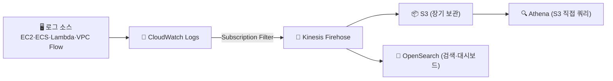
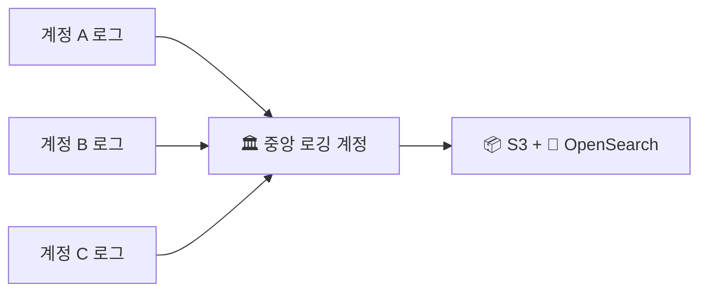

> **중앙 집중 로깅** → 여러 서비스·계정·인스턴스에 흩어진 로그를 **한 곳으로 모으는** 구조
>
> 문제 → 로그가 흩어지면 검색·상관분석·감사 불가
>
> 해결 → 수집 → 전송 → 저장/검색 **파이프라인**으로 일원화

<KeyPoint title="이 글의 핵심">
로그를 **모으는 게 목적이 아니라, 모아서 빠르게 검색·분석·보관**하는 게 목적.
저장은 싸게(S3), 검색은 빠르게(OpenSearch), 둘을 나눠 설계한다.
</KeyPoint>

---

## 1. 왜 중앙화

- 흩어진 로그의 고통:
  - 인스턴스마다 SSH 들어가 `grep` → 불가능
  - 장애 시 여러 서비스 로그를 **시간순으로 상관분석** 못 함
  - 계정·리전 분산 → 감사·보존 정책 제각각
- 중앙화하면 → **한 곳에서 검색·대시보드·알림·장기보관**

---

## 2. 표준 파이프라인

- **CloudWatch Logs** → 1차 수집 지점
- **Subscription Filter** → 로그를 실시간으로 다음 단계로 흘려보냄
- **Kinesis Data Firehose** → 버퍼링·변환 후 목적지로 적재
- **S3** → 싸게 **장기 보관** (+Athena로 필요시 쿼리)
- **OpenSearch** → **빠른 검색·대시보드**(Kibana)

---

## 3. 저장·검색 목적지 — 어디로 보낼까

| 목적지 | 용도 | 특징 |
|------|------|------|
| **S3** | 장기 보관·아카이브 | 가장 쌈 · 라이프사이클로 Glacier 이동 |
| **Athena** | S3 로그를 가끔 쿼리 | 서버리스 · 쿼리당 과금 |
| **OpenSearch** | 실시간 검색·대시보드 | 빠름 · 클러스터 상시 비용 ⬆️ |

<ProsCons>
<Pros title="S3 + Athena">
- 저장 비용 최저
- 서버리스 (관리 0)
- 가끔 분석·감사에 적합
</Pros>
<Cons title="S3 + Athena 단점">
- 쿼리 지연 (실시간 X)
- 대시보드·알림 약함
- 잦은 검색엔 비효율
</Cons>
</ProsCons>

<ProsCons>
<Pros title="OpenSearch">
- 실시간 검색·시각화
- Kibana 대시보드
- 운영 모니터링에 강함
</Pros>
<Cons title="OpenSearch 단점">
- 클러스터 상시 비용
- 운영 부담 (샤드·용량)
- 장기 보관엔 비쌈
</Cons>
</ProsCons>

<Note type="success" title="실무 조합">
- **둘 다** 보내는 게 흔함 → OpenSearch(최근 검색) + S3(장기 보관)
- 최근 2주 OpenSearch 보관 → 이후 S3 Glacier로 → 비용·검색 둘 다 잡음
</Note>

---

## 4. 교차 계정 중앙 로깅

- 멀티 계정 → 각 계정 로그를 **중앙 로깅 계정**으로 모음
- 로그 변조 방지·감사 일원화

<Note type="warning" title="보안">
- 로깅 계정은 **쓰기 전용 권한**만 부여 → 누가 로그 지우지 못하게
- [Organizations](/devops/aws/iam/organizations) + [CloudTrail](/devops/aws/monitoring/cloudtrail) 조직 트레일과 결합
</Note>

---

## 5. 실무 정리

<Note type="pink" title="정리">
- 수집(CloudWatch Logs) → 전송(Firehose) → 저장(S3)·검색(OpenSearch) 분리
- 비용 핵심: **검색용은 짧게(OpenSearch), 보관용은 싸게(S3→Glacier)**
- 멀티 계정 → 중앙 로깅 계정 + 쓰기 전용 권한
- 구조화 로그(JSON)로 남기면 → 검색·필터 훨씬 쉬움
- 관측성 3종(지표·로그·추적) 중 "로그" 축의 인프라 설계가 이 문서
</Note>
