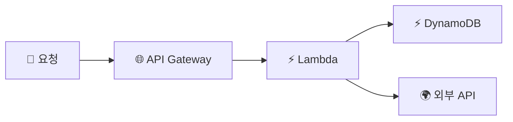

> **X-Ray** → 요청 하나가 **여러 서비스를 거치는 흐름**을 추적
>
> MSA·서버리스 → 요청이 API→Lambda→DB→외부API… 흩어짐 → "어디서 느려졌나?"
>
> 로그·지표로 안 보이는 **요청 단위 경로·지연**을 시각화

---

## 한눈에

<Cards cols={3}>
<Card icon="🧵" title="Trace">
요청 1건의 전체 여정
</Card>
<Card icon="🧩" title="Segment">
한 서비스가 처리한 구간
</Card>
<Card icon="🔬" title="Subsegment">
구간 내 세부(DB 쿼리·외부 호출)
</Card>
<Card icon="🗺️" title="서비스 맵">
서비스 간 호출 관계·지연 시각화
</Card>
<Card icon="🐌" title="병목 탐지">
어느 단계가 느린지 한눈에
</Card>
<Card icon="📡" title="OpenTelemetry">
표준 계측(ADOT)으로 수집
</Card>
</Cards>

---

## 1. 왜 분산 추적

- 모놀리식 → 로그 한 곳 → 디버깅 쉬움
- MSA·서버리스 → 요청이 **여러 서비스** 거침 → 로그가 흩어져 "어디가 느린지" 모름



- X-Ray → 위 흐름의 **각 구간 소요 시간**을 trace로 묶어 보여줌
- "전체 1.2초 중 외부 API가 900ms" 처럼 **병목 식별**

---

## 2. 핵심 개념 — Trace · Segment · Subsegment

| 개념 | 의미 |
|------|------|
| **Trace** | 요청 1건의 끝-끝 여정 (고유 Trace ID) |
| **Segment** | 한 서비스/리소스가 처리한 구간 |
| **Subsegment** | 구간 내 세부 작업 (DB 쿼리, HTTP 호출) |
| **Annotation** | 검색 가능한 키-값 (필터용) |
| **Metadata** | 부가 정보 (검색 불가) |

<Note type="note" title="Trace ID 전파">
- 요청이 서비스 넘어갈 때 **Trace ID를 헤더로 전파**(`X-Amzn-Trace-Id`)
- → 흩어진 segment들이 하나의 trace로 묶임
</Note>

---

## 3. 계측 — 코드에 X-Ray 붙이기

- SDK·OpenTelemetry(ADOT)로 자동/수동 계측
- Lambda → 설정 한 번으로 활성 / ECS·EC2 → X-Ray 데몬 + SDK

Python SDK 예 (boto3 자동 추적):

```python
from aws_xray_sdk.core import xray_recorder, patch_all
patch_all()  # boto3·requests 등 자동 계측

@xray_recorder.capture("process_order")
def process_order(order_id):
    # 이 함수가 하나의 subsegment로 기록됨
    ...
```

<Note type="success" title="OpenTelemetry 권장">
- 요즘은 벤더 중립 **OpenTelemetry(ADOT)** 로 계측 → X-Ray·다른 백엔드 동시 전송 가능
- 락인 줄이고 표준 추적
</Note>

---

## 4. 서비스 맵 & 병목

- **서비스 맵** → 서비스 노드 + 호출 관계 + 각 노드의 지연·에러율을 그래프로
- 빨간 노드 = 에러·지연 → 바로 병목 식별

<Note type="pink" title="실무 정리">
- MSA·서버리스 디버깅 필수 → 요청 흐름·병목을 trace로
- 지표(CloudWatch)·로그(Logs)·추적(X-Ray) **3종 세트**가 관측성(observability)
- Annotation에 `userId`·`orderId` 넣어 특정 요청 추적
- 계측은 **OpenTelemetry(ADOT)** 표준으로
- 샘플링 비율 조정 → 비용 ⬇️ (전수 추적은 과함)
</Note>
