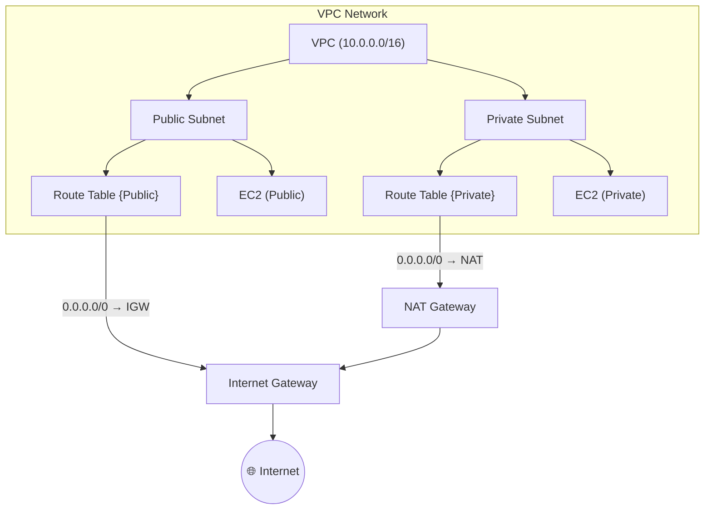
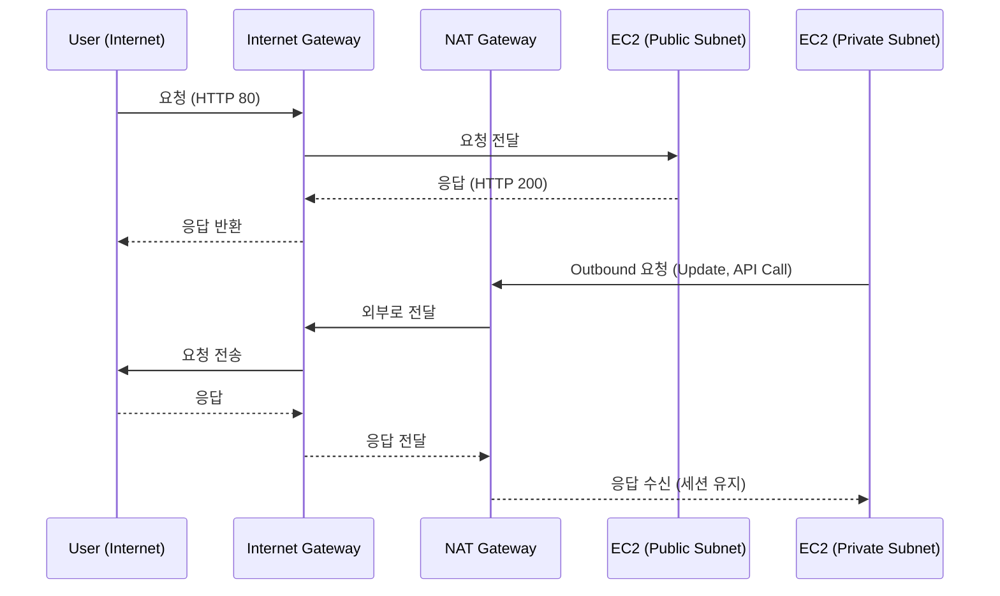

> AWS 네트워크에서 **외부 인터넷과 연결되는 진입점**은 `Internet Gateway`와 `NAT Gateway`가 담당
>
> 두 게이트웨이는 **트래픽의 방향성(Inbound/Outbound)** 과 **보안 레벨**에서 명확히 다름
---
## 핵심 개념

| 항목 | Internet Gateway (IGW) | NAT Gateway |
|------|--------------------------|--------------|
| 역할 | 인터넷과 양방향 통신 가능 | 프라이빗 서브넷에서 외부로 나가는 통신만 가능 |
| 방향성 | Inbound + Outbound | Outbound Only |
| 위치 | VPC에 직접 Attach | 퍼블릭 서브넷에 배치 |
| 대상 Subnet | Public Subnet | Private Subnet |
| 필요한 IP | Public IP / Elastic IP 필요 | Elastic IP 필요 |
| 트래픽 경로 | Route Table: `0.0.0.0/0 → igw-xxxx` | Route Table: `0.0.0.0/0 → nat-xxxx` |
| 보안 관점 | 외부 접근 가능 (노출됨) | 외부에서 접근 불가 (보호됨) |
---
## 개념 정리
<Stepper>

<StepperItem title="1️⃣ Internet Gateway (IGW)">
**VPC와 외부 인터넷 간 통신을 가능하게 해주는 게이트웨이**

- IGW는 VPC에 한 개만 Attach 가능  
- Public Subnet이 외부와 통신하려면 반드시 필요  
- 외부에서 접근(Inbound)이 가능한 유일한 진입로  

```bash
# IGW 생성 및 연결 (AWS CLI 예시)
aws ec2 create-internet-gateway
aws ec2 attach-internet-gateway --internet-gateway-id igw-12345 --vpc-id vpc-abcde
💡 IGW를 통한 트래픽 흐름
Client → Internet → IGW → Public Subnet → EC2
```
</StepperItem>

<StepperItem title="2️⃣ NAT Gateway"> 
**Private Subnet에서 외부로 나가기 위한 전용 통신 게이트웨이**
- Outbound 전용 (인터넷 → 내부 진입 불가)
- Public Subnet에 생성되며 Elastic IP를 통해 외부와 통신
- Private Subnet 인스턴스가 업데이트, API 호출 등을 수행할 때 필요

# NAT Gateway 생성 (CLI 예시)
```bash
aws ec2 create-nat-gateway \
  --subnet-id subnet-public-123 \
  --allocation-id eipalloc-xxxxxx

💡 NAT Gateway를 통한 트래픽 흐름
Private EC2 → Route Table → NAT GW → IGW → Internet
```
</StepperItem>

<StepperItem title="3️⃣ IGW vs NAT GW 구조 비교">

설명
- Public Subnet: IGW를 통해 외부와 양방향 통신 가능
- Private Subnet: NAT GW를 통해 외부로만 통신 가능 (응답만 허용)

</StepperItem>
<StepperItem title="4️⃣ Egress-Only Internet Gateway (IPv6)"> 
- IPv6 환경에서는 NAT Gateway가 작동 ❌ 
- 대신 **Egress-Only Internet Gateway**를 사용

| 항목             | 설명                          |
| -------------- | --------------------------- |
| 대상             | IPv6 전용 VPC                 |
| 역할             | IPv6 트래픽의 Outbound 전용 게이트웨이 |
| 특징             | 외부에서 내부로의 접근은 불가            |
| Route Table 설정 | `::/0 → eigw-xxxx`          |


💡 이름 그대로 “Egress Only = 나가기만 가능”
</StepperItem>

</Stepper>
---
## 실전 구조
```
VPC (10.0.0.0/16)
├─ Public Subnet (10.0.1.0/24)
│   ├─ ALB / Bastion Host
│   ├─ Route Table → 0.0.0.0/0 → IGW
│   └─ IGW 연결 (인터넷 접근 가능)
└─ Private Subnet (10.0.10.0/24)
    ├─ App / DB Server
    ├─ Route Table → 0.0.0.0/0 → NAT GW
    └─ Outbound만 허용
```
---
## 아키텍처 트래픽 흐름

---
## Tip
- Public Subnet에는 반드시 IGW가 연결되어야함
- Private Subnet은 IGW 대신 NAT GW를 사용 (Outbound 전용)
- NAT GW는 AZ별로 하나씩 배치 -> 장애 시에도 트래픽 유지 가능
- 비용 절약 : 테스트 환경은 EC2 기반 NAT Instance로 대체 가능
- IPv6 환경에서는 NAT 대신 Egress-Only IGW 사용