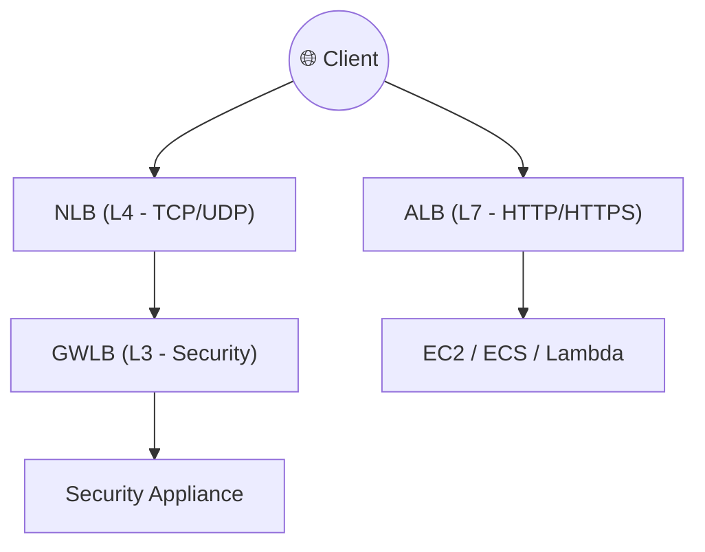
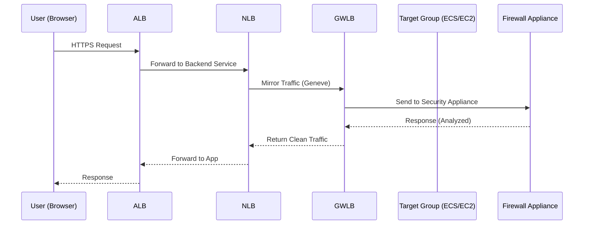

<Note type="" title="Note">
  AWS 로드 밸런서는 L4 ~ L7 계층에서 트래픽을 분산하고

  서비스의 **고가용성 (HA)** 과 **무중단 확장성** 을 보장

</Note>
---
## 핵심 개념

| 구분 | ALB (Application) | NLB (Network) | GWLB (Gateway) |
|------|--------------------|----------------|----------------|
| 계층 | L7 (HTTP/HTTPS) | L4 (TCP/UDP/TLS) | L3/L4 (IP) |
| 사용 목적 | 웹 트래픽 라우팅 | 고성능 네트워크 트래픽 | 네트워크 보안/모니터링 트래픽 |
| 프로토콜 | HTTP, HTTPS, WebSocket | TCP, UDP, TLS | GENEVE (6081) |
| 타겟 유형 | EC2, ECS, Lambda | EC2, IP, ALB | Security Appliance (EC2) |
| 주요 기능 | Path/Host 기반 라우팅, WAF 연동 | 초고속 처리, 고정 IP | 미러링/보안 트래픽 라우팅 |
| IP 고정 여부 | ❌ (DNS 기반) | ✅ (Elastic IP 가능) | ✅ (Appliance IP 고정) |
| 내부/외부 지원 | ✅ | ✅ | ✅ |
| 비용 | 중간 | 낮음 (Throughput 기준) | 중간~높음 (Appliance 포함) |

---
## 개념 정리
<Stepper>

<StepperItem title="1️⃣ ALB (Application Load Balancer)">
**HTTP / HTTPS 계층의 L7 로드밸런서**

- URL Path / Host 기반으로 요청을 세분화 라우팅  
- WebSocket, HTTP/2 지원  
- ECS(Fargate), Lambda, EC2 등과 직접 연결 가능  
- WAF, Shield, ACM 인증서와 쉽게 통합 가능  

```bash
# ALB 생성 예시
aws elbv2 create-load-balancer \
  --name my-alb \
  --subnets subnet-1 subnet-2 \
  --security-groups sg-123456
```
📘 라우팅 예시

| 조건          | 대상 그룹(Target Group) |
| ----------- | ------------------- |
| `/api/*`    | Backend TG          |
| `/static/*` | Frontend TG         |
| `/health`   | Healthcheck TG      |


💡 Best Practice
- ALB는 HTTP 레벨에서 동작하므로, 애플리케이션 계층 라우팅에 이상적
- HTTPS Termination (SSL Offloading) 지점으로 자주 사용
- ALB + Auto Scaling 조합으로 무중단 확장

</StepperItem>
<StepperItem title="2️⃣ NLB (Network Load Balancer)"> 
**초당 수백만 TPS 처리 가능한 L4 로드밸런서**
- TCP, UDP, TLS 기반의 저지연 고성능 트래픽 처리
- Static IP 또는 Elastic IP 할당 가능
- Health Check는 TCP/HTTP 방식 지원
- TLS Termination / Pass-through 모두 가능

```bash
# NLB 생성 예시
aws elbv2 create-load-balancer \
  --name my-nlb \
  --type network \
  --subnets subnet-1 subnet-2
```
📘 특징
- IP 고정이 가능하여 방화벽/화이트리스트 환경에 유리
- ALB 대비 단순하지만 훨씬 빠름
- AWS PrivateLink 엔드포인트로도 사용 가능

💡 Best Practice
- 실시간 스트리밍, 금융 트랜잭션, IoT 게이트웨이 등 고속 통신용
- 보안/규제 환경에서 고정 IP가 필수일 때 적합

</StepperItem>
<StepperItem title="3️⃣ GWLB (Gateway Load Balancer)"> 
**보안 트래픽을 분산 처리하는 L3/L4 로드밸런서**
- GENEVE 프로토콜 (Port 6081) 기반
- Security Appliance (방화벽, IDS, IPS 등) 트래픽을 투명하게 분산
- 실제 트래픽을 복제/전달하여 Inline 보안 처리

```bash
# GWLB 생성 예시
aws elbv2 create-load-balancer \
  --name my-gwlb \
  --type gateway \
  --subnets subnet-1 subnet-2
```

📘 활용 예시

| 시나리오    | 설명                      |
| ------- | ----------------------- |
| 트래픽 미러링 | 보안 로그 수집 / 분석           |
| 트래픽 필터링 | Firewall Appliance 로 전달 |
| 내부 감시   | IDS/IPS 통합 운영           |


💡 Best Practice
- N/S 트래픽 (North-South) 보안 필터링 구조에 적합
- GWLB + Firewall + Transit Gateway 조합으로 중앙 집중형 보안 아키텍처 구성

</StepperItem>
<StepperItem title="4️⃣ ALB / NLB / GWLB 아키텍처 비교">

📘 요약
- ALB → Application 계층 분기 (Route by URL / Host)
- NLB → Network 계층 연결 (High Throughput)
- GWLB → Gateway 계층 트래픽 복제/분석

</StepperItem>
</Stepper>
---
## 트래픽 흐름

---
## Tip
1. ALB
  - L7 기반 -> URL 별 Target Group 분리
  - WAF + ACM(SSL 인증서) 연동 추천
  - ECS, Lambda 등 서버리스 환경과 궁합 좋음
2. NLB
  - 고정 IP 필요 시 선택
  - PrivateLink / EKS Ingress Controller와 자주 사용
  - HealthCheck를 단순화하여 빠른 Failover 구성
3. GWLB
  - 중앙집중형 보안 아키텍쳐 (보안 허브 역할)
  - Firewall, IDS/IPS, Traffic Analyzer 등과 통합
  - Transit Gateway 와 함께 사용 시 Cross-VPC 모니터링 가능