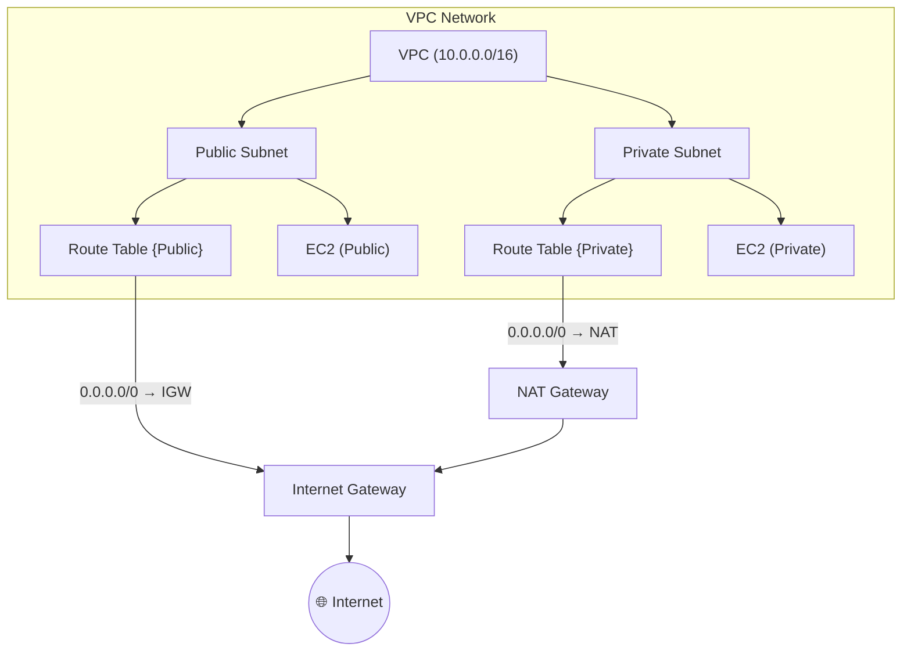

> **VPC의 모든 네트워크 트래픽은 Route Table을 통해 목적지를 찾음**
>
> CIDR은 그 트래픽이 어떤 IP 범위 안에 있는가를 정의하는 규칙
---
## 핵심 개념

| 개념 | 설명 |
|------|------|
| **CIDR (Classless Inter-Domain Routing)** | IP 주소를 효율적으로 나누기 위한 표기 방식 (예: `10.0.0.0/16`) |
| **Route Table** | VPC/Subnet의 트래픽이 어디로 향할지 결정하는 “지도” |
| **Destination** | 트래픽의 목적지 IP 범위 (CIDR 형식) |
| **Target** | 트래픽을 전달할 다음 홉 (IGW, NAT, TGW, local 등) |
| **Local Route** | VPC 내부 통신을 위한 기본 경로 (모든 Subnet 간 통신 가능) |
---
## 개념 정리
<Stepper>

<StepperItem title="1️⃣ CIDR 기본 구조">
CIDR(Classless Inter-Domain Routing)은 IP 주소 대역을 효율적으로 나누기 위한 방식

- 형식: `IP주소/Prefix`
- 예시: `10.0.0.0/16` → 첫 16비트는 네트워크 식별자, 나머지 16비트는 호스트 식별자

| CIDR | 총 IP 수 | 사용 가능 IP | 예시 범위 |
|------|-----------|---------------|-------------|
| `/16` | 65,536 | 65,534 | 10.0.0.0 ~ 10.0.255.255 |
| `/24` | 256 | 254 | 10.0.1.0 ~ 10.0.1.255 |
| `/28` | 16 | 14 | 10.0.1.0 ~ 10.0.1.15 |

💡 VPC의 CIDR은 `/16` 정도로 잡고,  
서브넷은 `/24` 단위로 잘라서 나누는 게 일반적
</StepperItem>

<StepperItem title="2️⃣ Route Table의 역할">
각 Subnet은 반드시 하나의 Route Table과 연결됨
Route Table은 “이 IP 대역의 패킷을 어디로 보낼지”를 결정

| Destination | Target | 설명 |
|--------------|---------|------|
| `10.0.0.0/16` | local | VPC 내부 트래픽 (자동 생성) |
| `0.0.0.0/0` | igw-12345 | 외부 인터넷 트래픽 (Public Subnet) |
| `0.0.0.0/0` | nat-67890 | 프라이빗 Subnet이 외부로 나갈 때 |
| `192.168.0.0/16` | tgw-xxxx | 다른 VPC로 라우팅 (Transit Gateway) |

> 기본적으로 모든 Subnet은 내부(local) 통신이 가능하지만,  
> 외부로 나가려면 IGW 또는 NAT GW 경로가 필요
</StepperItem>

</Stepper>
---
## 트래픽 흐름

- public subnet : Route table에 `0.0.0.0/0 -> IGW`
- private subnet : Route table에 `0.0.0.0/0 → NAT GW`
- 두 서브넷 모두 `10.0.0.0/16 -> local`로 내부 통신 가능
---
## 실전 아키텍쳐 흐름
```
10.0.0.0/16  → VPC 전체 IP 대역
  ├─ 10.0.1.0/24 → Public Subnet A (RT → IGW)
  ├─ 10.0.2.0/24 → Public Subnet B (RT → IGW)
  ├─ 10.0.10.0/24 → Private Subnet A (RT → NAT)
  └─ 10.0.11.0/24 → Private Subnet B (RT → NAT)
```
---
## CIDR 예시
- VPC : `10.0.0.0/16`

| Subnet 이름        | CIDR         | AZ              | 비고           |
| ---------------- | ------------ | --------------- | ------------ |
| Public Subnet A  | 10.0.1.0/24  | ap-northeast-2a | ALB, Bastion |
| Public Subnet B  | 10.0.2.0/24  | ap-northeast-2b | ALB          |
| Private Subnet A | 10.0.10.0/24 | ap-northeast-2a | App Server   |
| Private Subnet B | 10.0.11.0/24 | ap-northeast-2b | DB Server    |

- 내부 통신 (local)은 VPC 내부에서 자동 허용
- 외부 인터넷은 public만 IGW를 통해 가능
- Private은 NAT GW를 통해 Outbound만 가능
---
## Tip
- NAT Gateway는 AZ별로 1개씩 배치(SPOF 방지)
- Route Table은 Subnet별로 분리해서 관리(명확한 역할 구분)
- CIDR 대역은 확장성을 고려해 여유있게 설정 (ex. `/16`은 나중에 `/17`로 분할 가능)
- CIDR은 겹치면 절대 안됨 (VPC Peering 시 충돌 발생)