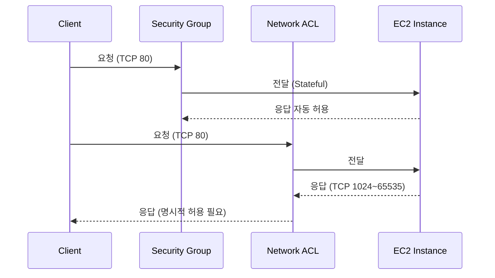
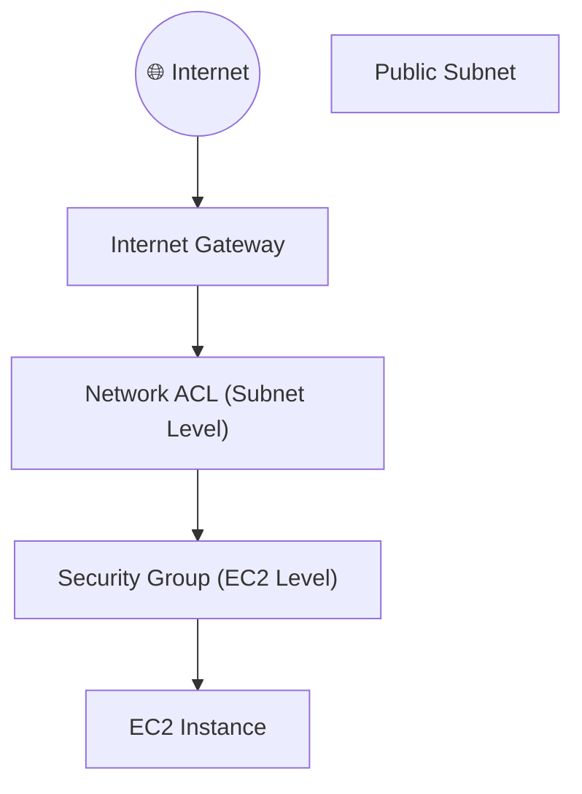

<Note type="" title="Note">
  AWS VPC 보안은 두 단계로 구성

  1️⃣ 인스턴스 단위의 **Security Group (SG)**

  2️⃣ 서브넷 단위의 **Network ACL (NACL)**

  이 둘은 함께 작동하여 네트워크 트래픽의 Inbound / Outbound 제어

</Note>
---
## 핵심 개념

| 항목 | Security Group (SG) | Network ACL (NACL) |
|------|----------------------|--------------------|
| 관리 단위 | 인스턴스 (ENI) | 서브넷 단위 |
| 동작 방식 | 상태 기반 (Stateful) | 비상태 기반 (Stateless) |
| 방향 설정 | Inbound / Outbound 규칙 | Inbound / Outbound 각각 |
| 평가 순서 | 모든 규칙 평가 후 허용 | 규칙 번호 순서대로 평가 |
| 기본 동작 | 모든 트래픽 거부 (명시적 허용 필요) | 기본 허용 (명시적 거부 가능) |
| 로그 제공 | VPC Flow Logs | VPC Flow Logs |
| 사용 사례 | EC2 접근 제어 | Subnet 보안 경계 |

---
## 개념 정리
<Stepper>

<StepperItem title="1️⃣ Security Group (SG)">

**EC2 인스턴스 수준의 가상 방화벽**  
SG는 VPC 내 인스턴스(ENI, Elastic Network Interface)에 연결되며, 인바운드/아웃바운드 트래픽을 제어

💡 **Stateful 특징**
- 인바운드 트래픽이 허용되면 해당 연결의 아웃바운드 응답은 자동 허용
- “한쪽만 열면 양방향 통신 가능”

| 구분 | 예시 | 설명 |
|------|------|------|
| 인바운드 | TCP 22 (SSH), 80 (HTTP) | 외부에서 인스턴스로 접근 허용 |
| 아웃바운드 | ALL | 인스턴스에서 외부 요청 허용 |

```bash
# SG 생성 예시
aws ec2 create-security-group \
  --group-name my-sg \
  --description "My Web SG" \
  --vpc-id vpc-123456

# 인바운드 규칙 추가
aws ec2 authorize-security-group-ingress \
  --group-id sg-123456 \
  --protocol tcp --port 80 --cidr 0.0.0.0/0
```
📘 요약
- 인스턴스 단위로 세밀한 제어 가능
- Stateful이므로 응답 트래픽은 자동 허용
- SSH, HTTP 등 서비스 포트 접근 제어에 최적화

</StepperItem>
<StepperItem title="2️⃣ Network ACL (NACL)"> 

**Subnet 단위의 네트워크 경계 보안 계층**
NACL은 Stateless (비상태 기반) 으로, 들어오는 트래픽과 나가는 트래픽을 각각 명시적으로 허용

| 항목        | 설명                        |
| --------- | ------------------------- |
| 평가 순서     | Rule 번호(1~32766) 순서대로 평가  |
| 기본 규칙     | Allow All                 |
| Stateless | 인바운드 허용 시 아웃바운드도 별도 허용 필요 |

```bash
# NACL 생성 예시
aws ec2 create-network-acl --vpc-id vpc-123456

# 인바운드 허용 규칙 추가 (80포트)
aws ec2 create-network-acl-entry \
  --network-acl-id acl-123456 \
  --rule-number 100 --protocol tcp \
  --rule-action allow --egress false \
  --cidr-block 0.0.0.0/0 --port-range From=80,To=80

# 아웃바운드 응답 규칙 추가
aws ec2 create-network-acl-entry \
  --network-acl-id acl-123456 \
  --rule-number 110 --protocol tcp \
  --rule-action allow --egress true \
  --cidr-block 0.0.0.0/0 --port-range From=1024,To=65535
```

📘 요약
- Subnet 단위로 적용
- Stateless → 인/아웃 모두 정의 필요
- Rule 번호 순서대로 평가 (낮은 번호 우선)

</StepperItem>
<StepperItem title="3️⃣ Stateful vs Stateless 시각 비교">

- SG: 연결 상태를 기억 (Stateful)
- NACL: 각 방향 별로 규칙 평가 (Stateless)

</StepperItem>
<StepperItem title="4️⃣ SG & NACL 통합 설계 패턴"> 

SG와 NACL은 **서로 보완 관계**로 동작

| 항목    | SG               | NACL                     |
| ----- | ---------------- | ------------------------ |
| 단위    | 인스턴스             | 서브넷                      |
| 방향성   | 양방향(Stateful)    | 단방향(Stateless)           |
| 관리 목적 | 애플리케이션 접근 제어     | 네트워크 경계 차단               |
| 일반 구성 | Inbound만 관리      | Inbound + Outbound 모두 관리 |
| 충돌 시  | NACL → SG 순으로 평가 |                          |


💡 Best Practice

- Public Subnet: NACL을 기본 허용, SG로 세밀 제어
- Private Subnet: NACL에서 기본 차단 후 SG로 예외 허용
- 모든 SSH 접근은 Bastion Host를 통해 간접 접근

</StepperItem>
</Stepper>

---
## 아키텍쳐 흐름

---
## Tip
- SG는 서비스 별로 세분화 (예: `web-sg`, `db-sg`, `bastion-sg`)
- NACL은 Subnet 보안 경계용, SG 보다 제한적 사용
- Rule 관리 시 SG는 **허용중심**, NACL은 **차단중심** 으로 설계
- Flow Logs를 통해 SG/NACL Drop 트래픽 모니터링