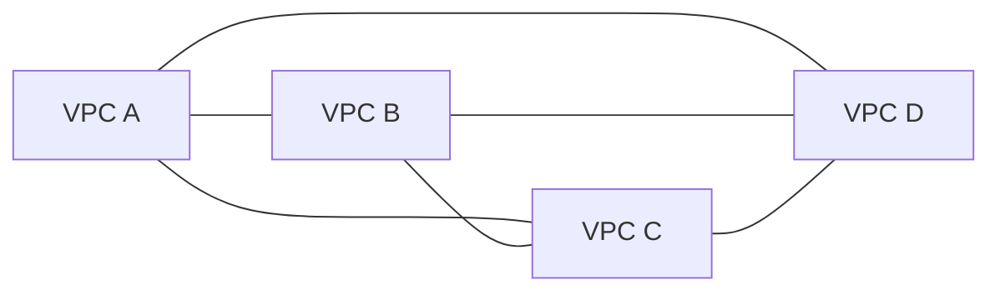
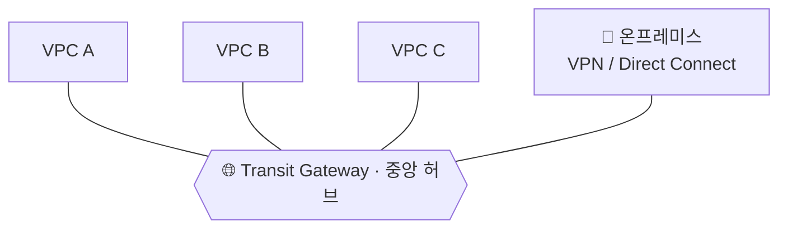
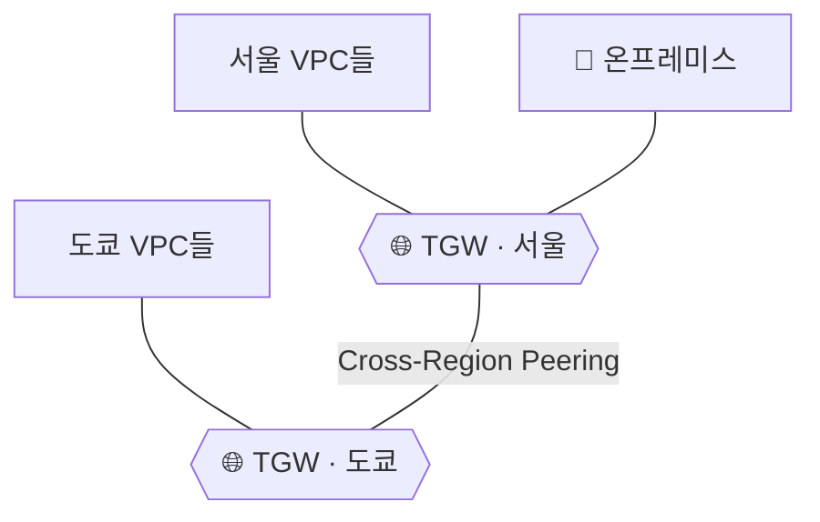

> **Transit Gateway(TGW)** → 여러 VPC + 온프레미스를 **하나의 중앙 허브**로 연결하는 라우터
>
> 문제 → VPC가 많아지면 1:1 연결(Peering)이 **거미줄(full mesh)** 처럼 폭발
>
> 해결 → 모두를 **TGW 하나에 연결** → 허브앤스포크로 단순화

---

## 한눈에

<Cards cols={3}>
<Card icon="🌐" title="Transit Gateway">
VPC·온프레미스를 잇는 **중앙 라우터(허브)**
</Card>
<Card icon="🔌" title="Attachment">
TGW에 붙는 연결 단위 · VPC / VPN / Direct Connect / 다른 TGW
</Card>
<Card icon="🗺️" title="TGW 라우트 테이블">
어떤 attachment끼리 통신할지 결정 · **망 분리(segmentation)**
</Card>
<Card icon="🕸️" title="VPC Peering 한계">
연결마다 1:1 · N개면 **N(N-1)/2** 개 → 관리 폭발
</Card>
<Card icon="🏢" title="하이브리드">
VPN / Direct Connect로 **온프레미스**도 같은 허브에
</Card>
<Card icon="🌍" title="Cross-Region">
다른 리전 TGW끼리 **peering** → 글로벌 백본
</Card>
</Cards>

---

## 1. 왜 필요한가 — VPC Peering의 한계

- VPC Peering → VPC 두 개를 **1:1** 로 직접 연결
- VPC 적을 땐 OK / 많아지면 **연결 수 폭발**
  - VPC 4개 → 6개 연결 · 10개 → **45개** 연결 (`N(N-1)/2`)
- Peering은 **전이(transitive) 불가** → A-B, B-C 있어도 A는 C와 통신 ❌

<Note type="warning" title="Peering의 벽">
- 연결마다 라우트 테이블 수동 관리
- 전이 라우팅 안 됨 → 풀메시로 다 이어야 함
- VPC 수 늘수록 **관리 불가능**
</Note>

---

## 2. 핵심 구조 — 허브앤스포크

- TGW = **중앙 허브** · 각 VPC/온프레미스는 **스포크**
- 모든 연결이 TGW 하나를 거침 → 연결 수 **N개로 선형화**

<Note type="success" title="달라지는 점">
- VPC 10개 → 연결 45개 ❌ → **TGW에 10개 attachment** ✅
- 새 VPC 추가 → TGW에 **attachment 하나만** 추가
- 전이 라우팅 O → A↔C도 TGW 거쳐 자동 통신
</Note>

---

## 3. Attachment — TGW에 뭘 붙이나

- **Attachment** = TGW에 연결되는 단위

| Attachment 종류 | 연결 대상 |
|------|------|
| **VPC** | VPC를 TGW에 연결 (서브넷별 ENI 생성) |
| **VPN** | 온프레미스를 IPsec VPN으로 |
| **Direct Connect** | 전용선(DX)으로 온프레미스 |
| **Peering** | 다른 리전의 TGW와 |

<Note type="note" title="VPC Attachment 동작">
- TGW가 VPC의 각 AZ 서브넷에 **ENI(네트워크 인터페이스)** 를 둠
- VPC 라우트 테이블 → `0.0.0.0/0` 또는 대상 CIDR을 **TGW로** 향하게 설정
</Note>

---

## 4. TGW 라우트 테이블 — 망 분리의 핵심

- attachment끼리 **무조건 다 통신하는 게 아님**
- **TGW 라우트 테이블**이 "누가 누구와 통신 가능"을 결정
- 두 동작으로 제어:
  - **Association** → attachment를 어느 라우트 테이블에 묶을지
  - **Propagation** → attachment의 CIDR을 라우트 테이블에 자동 전파할지

<Compare>
<CompareCol title="🟢 운영망 라우트 테이블" subtitle="Prod VPC들" color="green">
- Prod VPC들끼리만 통신
- 공유 서비스(VPC)로도 경로 전파
- 개발망과는 **분리**
</CompareCol>
<CompareCol title="🔵 개발망 라우트 테이블" subtitle="Dev VPC들" color="sky">
- Dev VPC들끼리만 통신
- 공유 서비스 접근 허용
- 운영망과는 **차단**
</CompareCol>
</Compare>

<Note type="pink" title="왜 중요">
- 라우트 테이블 분리 → **같은 TGW에 붙어 있어도 망을 격리**
- 예: Prod ↔ Dev 차단 + 둘 다 공유 서비스(로깅·인증)만 접근
</Note>

---

## 5. 하이브리드 & 글로벌 연결

- **VPN Attachment** → 빠른 구성 / 인터넷 경유 / 대역폭·지연 변동
- **Direct Connect** → 전용선 / 안정·저지연 / 구축 느림·비쌈
- **Cross-Region Peering** → 리전 다른 TGW끼리 연결 → 글로벌 네트워크 백본

---

## 6. VPC Peering vs Transit Gateway

| 기준 | VPC Peering | Transit Gateway |
|------|-------------|-----------------|
| 연결 방식 | 1:1 직접 | 중앙 허브 |
| 전이 라우팅 | ❌ 불가 | ✅ 가능 |
| 확장성 | 낮음 (`N(N-1)/2`) | 높음 (선형) |
| 온프레미스 | 별도 구성 | VPN/DX 통합 |
| 비용 | 데이터 전송만 | 시간당 + 데이터 처리 |
| 적합 | VPC 소수 | VPC 다수·하이브리드 |

<Note type="pink" title="실무 정리">
- VPC 2~3개 · 단순 → **Peering**으로 충분
- VPC 다수 · 온프레미스 연동 · 망 분리 필요 → **Transit Gateway**
- TGW는 **시간당 과금 + 데이터 처리 요금** → 소규모엔 과할 수 있음
- 망 격리 설계 → **TGW 라우트 테이블 분리**(association/propagation)로
</Note>
