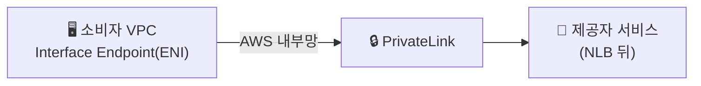
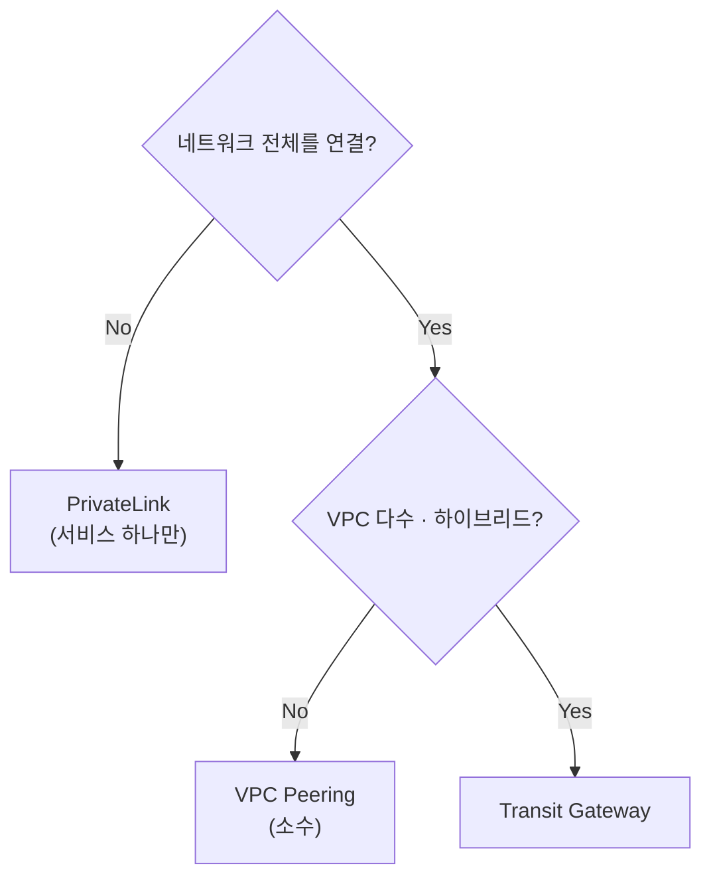

"VPC끼리, 또는 서비스에 **인터넷을 안 거치고** 어떻게 연결?" — 상황별 세 가지 선택지

## 셋 중 무엇을 — 결정 기준

| 상황 | 선택 |
|------|------|
| VPC 2~3개를 단순히 연결 | **VPC Peering** |
| VPC 다수 + 온프레미스 + 망 분리 | **Transit Gateway** |
| **특정 서비스 하나만** 프라이빗 노출/소비 | **PrivateLink** |

<KeyPoint title="핵심 차이">
Peering·TGW → **네트워크(VPC)를 연결** · PrivateLink → 네트워크를 잇지 않고
**서비스 하나만 콕 집어** 프라이빗하게 노출 — 양쪽 네트워크가 서로 안 보여 더 격리적
</KeyPoint>

## VPC Peering vs Transit Gateway

- 이미 [Transit Gateway](/devops/aws/networking/transit-gateway) 문서에서 다룬 내용 — 요약:
  - **Peering** → 1:1 직접 연결 · 전이 라우팅 ❌ · VPC 많으면 거미줄
  - **TGW** → 중앙 허브 · 전이 라우팅 ✅ · 다수 VPC·하이브리드

## PrivateLink — 서비스 단위 프라이빗 연결

- 제공자가 서비스를 **Endpoint Service**로 노출 → 소비자는 자기 VPC에 **Interface Endpoint(ENI)** 로 접근
- 트래픽이 **AWS 내부망**만 탐 (인터넷·IGW·NAT 불필요)



- 양쪽 VPC의 IP 대역이 겹쳐도 OK (네트워크를 안 합치니까)
- SaaS·사내 공유 서비스·AWS 서비스 접근에 사용

## VPC 엔드포인트 두 종류

| 종류 | 대상 | 특징 |
|------|------|------|
| **Gateway Endpoint** | S3 · DynamoDB | 라우트 테이블 경유 · **무료** |
| **Interface Endpoint** | 그 외 대부분 (PrivateLink) | ENI 생성 · 시간당 과금 |

예 — S3를 인터넷 없이 접근 (Gateway Endpoint):

```bash
aws ec2 create-vpc-endpoint \
  --vpc-id vpc-0abc \
  --service-name com.amazonaws.ap-northeast-2.s3 \
  --route-table-ids rtb-0def
```

<Note type="success" title="보안 이점">
- 프라이빗 서브넷에서 S3·DynamoDB·다른 서비스 접근 시 **NAT Gateway·인터넷 불필요**
- 트래픽이 AWS 내부망에 머무름 → 노출면·NAT 비용 ⬇️
</Note>

## 정리 — 한 장의 의사결정



<Note type="warning" title="흔한 선택 실수">
- 서비스 하나 쓰려고 VPC 전체를 Peering ❌ → 과한 연결·격리 약화
- 그럴 땐 **PrivateLink**로 그 서비스만 노출하는 게 더 안전
</Note>
