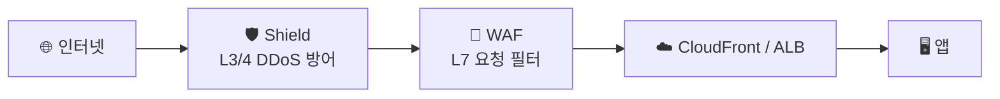

웹 서비스로 들어오는 트래픽은 여러 계층에서 공격받는다. AWS는 계층별로 방어 도구를 나눠 둔다.

## 어디를 막나 — 계층 방어



- **Shield** → 네트워크/전송 계층(L3/4) **물량 공격(DDoS)** 흡수
- **WAF** → 애플리케이션 계층(L7) **악성 요청**(SQLi·XSS·봇) 필터
- **Firewall Manager** → 위 정책들을 **여러 계정에 일괄** 적용

<KeyPoint title="역할 구분">
DDoS(물량) → **Shield** / 악성 요청(SQL 인젝션·XSS·봇) → **WAF** / 다계정 일괄 관리 → **Firewall Manager**.
한 도구로 다 막는 게 아니라 **계층별로 나눠** 막는다.
</KeyPoint>

## WAF — L7 요청 필터링

- ALB·CloudFront·API Gateway 앞에 붙여 **요청을 규칙으로 검사** → 허용/차단/카운트
- 규칙 종류:

| 규칙 | 용도 |
|------|------|
| **Managed Rule Groups** | AWS·서드파티 제공 (OWASP Top 10, 봇 등) |
| **Rate-based** | IP당 요청 수 제한 (브루트포스·스크래핑) |
| **IP Set** | 특정 IP 허용/차단 |
| **Geo Match** | 국가 기반 차단 |

레이트 제한 규칙 예 (5분당 IP 2000 초과 차단):

```json
{
  "Name": "rate-limit",
  "Priority": 1,
  "Statement": { "RateBasedStatement": { "Limit": 2000, "AggregateKeyType": "IP" } },
  "Action": { "Block": {} }
}
```

<Note type="note" title="Count 모드">
- 새 규칙은 바로 Block 말고 **Count 모드**로 먼저 → 정상 트래픽 오탐 확인 후 Block 전환
</Note>

## Shield — DDoS 방어

<Compare>
<CompareCol title="Shield Standard" subtitle="무료·기본" color="sky">
- 모든 계정 **자동 적용**
- L3/L4 일반 DDoS 방어
- 추가 비용·설정 없음
</CompareCol>
<CompareCol title="Shield Advanced" subtitle="유료" color="violet">
- L7 포함 고급 방어
- **DDoS 대응팀(DRT)** 지원
- 공격으로 인한 **요금 급증 보호**
- 대규모·민감 서비스용
</CompareCol>
</Compare>

## Firewall Manager — 다계정 일괄

- [Organizations](/devops/aws/iam/organizations) 전반에 WAF·Shield·보안그룹 정책을 **중앙에서 강제**
- 새 계정·리소스에도 자동 적용 → 정책 누락 방지

## 공격 유형별 방어 정리

| 공격 | 방어 도구 |
|------|------|
| SQL 인젝션 / XSS | **WAF** (Managed Rules) |
| 봇·스크래핑 | WAF (Rate-based + 봇 룰) |
| 브루트포스 로그인 | WAF Rate-based |
| 볼류메트릭 DDoS (L3/4) | **Shield** |
| 애플리케이션 DDoS (L7) | Shield Advanced + WAF |
| 특정 국가/IP | WAF Geo/IP Set |

<Note type="warning" title="기억할 것">
- WAF·Shield는 **CloudFront/ALB 앞단**에 둘 때 효과 최대 (엣지에서 차단)
- 단일 도구 만능 아님 → 계층별 조합 + [최소 권한·보안그룹](/devops/aws/networking/security)과 함께
</Note>
