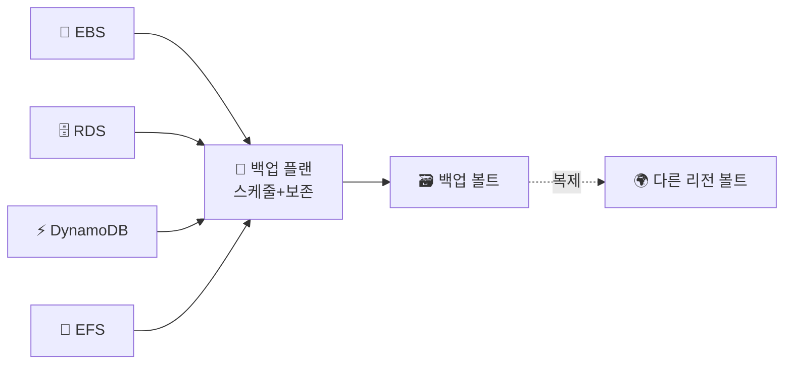
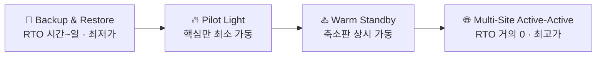

> **백업** → 데이터를 주기적으로 복사해 두는 것 (유실·실수 복구)
>
> **재해 복구(DR)** → 리전 장애 같은 큰 사고에서 **서비스를 되살리는 전략**
>
> 핵심 지표 → **RTO**(얼마나 빨리 복구) · **RPO**(얼마까지 데이터 손실 허용)

---

## 한눈에

<Cards cols={3}>
<Card icon="⏱️" title="RTO">
복구 목표 시간 · "얼마나 **빨리** 살리나"
</Card>
<Card icon="📉" title="RPO">
복구 목표 시점 · "데이터 **얼마까지** 잃어도 되나"
</Card>
<Card icon="🗃️" title="AWS Backup">
여러 서비스 백업을 **중앙 관리**
</Card>
<Card icon="📅" title="백업 플랜">
스케줄 + 보존 기간 정책
</Card>
<Card icon="🌍" title="Cross-Region">
다른 리전에 복사 → 리전 장애 대비
</Card>
<Card icon="🎚️" title="DR 전략">
비용 ↔ 복구 속도 4단계
</Card>
</Cards>

---

## 1. RTO vs RPO — DR의 두 지표

<Compare>
<CompareCol title="⏱️ RTO" subtitle="Recovery Time Objective" color="sky">
- **얼마나 빨리** 복구하나 (시간 축)
- "장애 후 4시간 내 정상화"
- 작을수록 → 빠른 복구 인프라 필요 → 비쌈
</CompareCol>
<CompareCol title="📉 RPO" subtitle="Recovery Point Objective" color="pink">
- **데이터 얼마까지** 잃어도 되나 (손실 축)
- "최대 5분치 데이터 손실 허용"
- 작을수록 → 잦은 백업/실시간 복제 필요 → 비쌈
</CompareCol>
</Compare>

<Note type="note" title="구분 예시">
- 하루 1번 백업 → RPO 최대 24시간 (마지막 백업 이후 데이터 손실)
- 복원에 2시간 → RTO 2시간
- 둘은 **별개 지표** → 요구사항에 따라 각각 설계
</Note>

---

## 2. AWS Backup — 백업 중앙화

- 예전 → 서비스마다 따로 (EBS 스냅샷·RDS 백업·DynamoDB 백업…)
- **AWS Backup** → 여러 서비스 백업을 **한 곳에서 정책으로 관리**

| 요소 | 설명 |
|------|------|
| **백업 플랜** | 스케줄(언제) + 보존 기간(얼마나) + 대상 |
| **백업 볼트** | 백업 저장소 · 암호화·접근 제어 |
| **Cross-Region/Account 복사** | 다른 리전·계정으로 복제 |

<Note type="success" title="장점">
- 서비스별 따로 관리 X → 정책 하나로 일괄
- 규정 준수(보존 기간)·감사 쉬움
</Note>

---

## 3. DR 4가지 전략 — 비용 ↔ 복구 속도

- 왼쪽일수록 **싸지만 느림** / 오른쪽일수록 **빠르지만 비쌈**

| 전략 | 방식 | RTO | 비용 |
|------|------|------|------|
| **Backup & Restore** | 백업만 → 사고 시 복원 | 시간~일 | 최저 |
| **Pilot Light** | 핵심(DB)만 복제·대기 | 수십 분 | 낮음 |
| **Warm Standby** | 축소판을 **항상 가동** | 분 | 중간 |
| **Active-Active** | 여러 리전 동시 운영 | 거의 0 | 최고 |

<Note type="pink" title="선택 기준">
- 비용 민감·중요도 낮음 → **Backup & Restore**
- 핵심 데이터만 살리면 됨 → **Pilot Light**
- 빠른 복구 필요 → **Warm Standby**
- 무중단 필수(금융·결제) → **Active-Active** ([Global Tables](/devops/aws/storage/dynamodb)·Multi-Region)
</Note>

---

## 4. 백업 ≠ DR

<Note type="warning" title="흔한 오해">
- "백업 있으니 DR 되는 거 아냐?" → 부분만 맞음
- **백업** = 데이터 복사본 (실수·유실 복구)
- **DR** = 백업 + **인프라·네트워크·복구 절차**까지 = 서비스 재가동 전략
- 백업만 있고 복구 리허설 안 하면 → 진짜 사고 때 못 살림
</Note>

<Note type="pink" title="실무 정리">
- RTO/RPO 먼저 정의 → 거기서 전략·비용 결정
- AWS Backup으로 정책 중앙화 + **Cross-Region 복사**(리전 장애 대비)
- RDS PITR·EBS 스냅샷·DynamoDB 백업과 연계
- 정기적 **복구 리허설** → 백업이 실제 살아나는지 검증
</Note>
