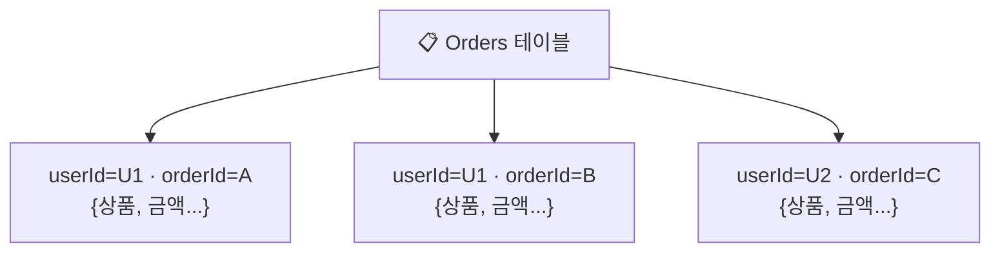
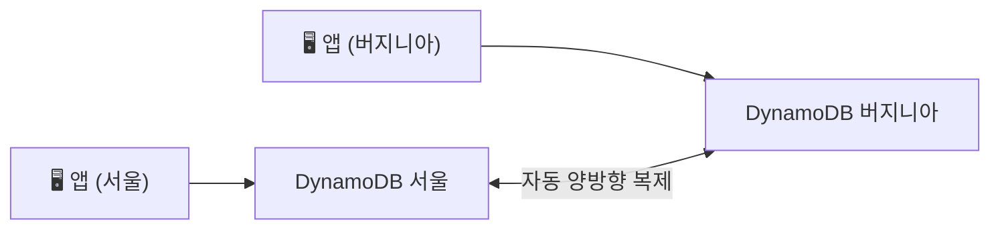

> **DynamoDB** → 완전관리형 **서버리스 NoSQL** (키-값 + 문서)
>
> 특징 → 무한 확장 · **한 자릿수 ms** 지연 · 운영 0
>
> 단, **관계형(JOIN·복잡 쿼리) 아님** → 키 기반 접근에 최적화

---

## 한눈에

<Cards cols={3}>
<Card icon="🔑" title="파티션 키">
데이터를 분산하는 기준 · 해시로 저장 위치 결정
</Card>
<Card icon="↕️" title="정렬 키">
같은 파티션 내 정렬·범위 조회 (선택)
</Card>
<Card icon="🧭" title="GSI / LSI">
보조 인덱스 → 다른 키로 조회
</Card>
<Card icon="🔍" title="Query vs Scan">
Query(키 기반·빠름) vs Scan(전체·느림)
</Card>
<Card icon="⚡" title="용량 모드">
On-demand(알아서) vs Provisioned(RCU/WCU)
</Card>
<Card icon="🌍" title="Global Tables">
멀티 리전 **액티브-액티브** 복제
</Card>
</Cards>

---

## 1. DynamoDB vs RDS — NoSQL의 선택

<Compare>
<CompareCol title="🗄️ RDS (관계형)" subtitle="SQL" color="sky">
- 테이블 간 JOIN · 복잡 쿼리
- 스키마 고정
- 수직 확장 중심
- 트랜잭션·정합성 강함
</CompareCol>
<CompareCol title="⚡ DynamoDB (NoSQL)" subtitle="키-값/문서" color="pink">
- **키 기반 조회** 최적화 (JOIN ❌)
- 스키마 유연 (item마다 속성 다름)
- **무한 수평 확장**
- 대규모 트래픽·낮은 지연
</CompareCol>
</Compare>

<Note type="note" title="언제 DynamoDB">
- 조회 패턴이 **키로 명확** (세션·장바구니·사용자 프로필·IoT)
- 트래픽 급증·무한 확장 필요
- 복잡한 조인·집계·리포팅 → RDS가 맞음
</Note>

---

## 2. 데이터 모델 — 테이블 · 아이템 · 키

- **테이블** → 아이템(행) 모음 · 스키마 고정 X
- **아이템** → 속성(attribute) 묶음 · 아이템마다 속성 달라도 됨
- **기본 키(Primary Key)** → 아이템을 유일하게 식별
  - **파티션 키(PK)** 단독, 또는
  - **파티션 키 + 정렬 키(SK)** 복합

<Note type="success" title="복합 키 활용">
- 파티션 키 `userId` + 정렬 키 `orderId`
- → "U1의 주문 전체"를 정렬 키 범위로 한 번에 Query
</Note>

---

## 3. 파티셔닝 & Hot Partition

- DynamoDB → 파티션 키 **해시**로 데이터를 여러 파티션에 분산
- 파티션 키가 한쪽에 몰리면 → **Hot Partition**(특정 파티션 과부하)

<Note type="warning" title="Hot Partition 주의">
- 나쁜 예 → 파티션 키 `country=KR` (대부분 한국) → 한 파티션 폭주
- 좋은 예 → `userId` 처럼 **고르게 퍼지는** 키 선택
- 키 설계가 성능을 좌우
</Note>

---

## 4. 보조 인덱스 — LSI vs GSI

- 기본 키 말고 **다른 속성으로 조회**하고 싶을 때

<Compare>
<CompareCol title="LSI (Local)" subtitle="같은 파티션 키" color="amber">
- 파티션 키 동일 + **다른 정렬 키**
- 테이블 **생성 시에만** 추가 가능
- 기존 용량 공유
</CompareCol>
<CompareCol title="GSI (Global)" subtitle="다른 파티션 키" color="green">
- **완전히 다른 키**로 조회
- 언제든 추가 가능
- **별도 용량**·결과적 일관성
</CompareCol>
</Compare>

<Note type="note" title="실무">
- 대부분 **GSI**로 해결 (유연)
- 예: 주문 테이블을 `status`(배송중/완료)로도 조회 → status GSI
</Note>

---

## 5. Query vs Scan

| 작업 | 방식 | 비용/속도 |
|------|------|------|
| **Query** | 파티션 키로 조회 (+정렬 키 범위) | 빠름·저렴 ✅ |
| **Scan** | 테이블 **전체** 훑기 | 느림·비쌈 ❌ |

<Note type="danger" title="Scan 지양">
- Scan → 전체 읽어 비용·지연 폭발
- 가능한 한 **Query**로 풀리게 키·인덱스 설계
</Note>

---

## 6. 용량 모드

<Compare>
<CompareCol title="On-demand" subtitle="알아서" color="green">
- 트래픽 따라 자동 확장
- 사용한 만큼 과금
- 변동 크거나 예측 어려울 때
</CompareCol>
<CompareCol title="Provisioned" subtitle="RCU/WCU 지정" color="sky">
- 초당 읽기(RCU)·쓰기(WCU) 미리 지정
- Auto Scaling 가능
- 트래픽 안정적 → 더 저렴
</CompareCol>
</Compare>

---

## 7. Streams & Global Tables

- **DynamoDB Streams** → 데이터 변경(추가/수정/삭제)을 **이벤트 스트림**으로
  - → Lambda 트리거 → 변경 감지·후처리(CDC)
- **Global Tables** → 여러 리전에 **액티브-액티브** 복제
  - 어느 리전에서 써도 다른 리전에 자동 반영 → 글로벌 저지연

<Note type="pink" title="실무 정리">
- 키 설계가 90% → 조회 패턴 먼저 정하고 PK/SK·GSI 설계
- Scan 피하고 Query로 풀리게
- 트래픽 예측 어려움 → On-demand로 시작
- 변경 후처리 → Streams + Lambda
- 글로벌 서비스 → Global Tables
- TTL 설정 → 만료 아이템 자동 삭제 (세션·캐시)
</Note>
