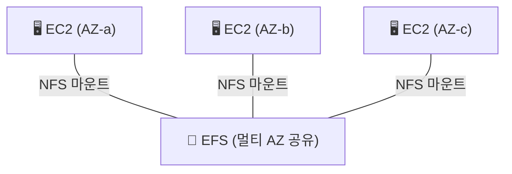

> **EBS** → EC2에 붙이는 **가상 하드디스크** (블록 · 1대 전용 · 단일 AZ)
>
> **EFS** → 여러 EC2가 동시에 쓰는 **공유 파일시스템** (NFS · 멀티 AZ)
>
> **FSx** → 특수 목적 **관리형 파일시스템** (Windows · Lustre 등)

---

## 한눈에

<Cards cols={3}>
<Card icon="💽" title="EBS">
EC2 1대에 붙는 블록 디스크 · 단일 AZ
</Card>
<Card icon="📁" title="EFS">
여러 EC2 동시 마운트 · 멀티 AZ · 자동 확장
</Card>
<Card icon="🗄️" title="FSx">
Windows(SMB)·Lustre(HPC) 등 특화 파일시스템
</Card>
<Card icon="📸" title="스냅샷">
EBS 백업 → S3에 저장 · 증분
</Card>
<Card icon="⚙️" title="볼륨 타입">
SSD(gp3/io2) · HDD(st1/sc1) → 성능/비용 차등
</Card>
<Card icon="🔗" title="마운트">
EBS=1:1 · EFS=N:1 (여러 대 공유)
</Card>
</Cards>

---

## 1. 블록 vs 파일 vs 객체 — 큰 그림

- 앞서 [S3](/devops/aws/storage/s3)는 **객체** → 여기선 **블록(EBS)** 과 **파일(EFS)**

| 유형 | 서비스 | 접근 | 비유 |
|------|------|------|------|
| **블록** | EBS | EC2에 마운트 (1대) | 내 PC의 하드디스크 |
| **파일** | EFS / FSx | 여러 대 NFS/SMB 마운트 | 사내 공유 폴더 |
| **객체** | S3 | HTTP API | 무한 창고(키-값) |

---

## 2. EBS — EC2의 하드디스크

- **블록 스토리지** → EC2에 붙여 OS·DB 디스크로 사용
- **단일 AZ** 결합 → 같은 AZ의 EC2에만 붙음
- 기본 **1:1** (한 볼륨 → 한 EC2) · io2는 multi-attach 예외
- 인스턴스 꺼져도 볼륨 데이터 유지 (분리/재연결 가능)

**볼륨 타입:**

| 타입 | 종류 | 용도 |
|------|------|------|
| **gp3 / gp2** | 범용 SSD | 대부분 (OS·일반 워크로드) |
| **io2 / io1** | 프로비저닝 IOPS SSD | 고성능 DB |
| **st1** | 처리량 HDD | 빅데이터·로그 (순차) |
| **sc1** | 콜드 HDD | 거의 안 쓰는 데이터 (최저가) |

<Note type="note" title="스냅샷">
- EBS 백업 → **S3에 증분 저장** (바뀐 블록만)
- 스냅샷으로 **다른 AZ/리전**에 볼륨 복원 → 단일 AZ 한계 보완
</Note>

---

## 3. EFS — 여러 EC2가 공유하는 파일시스템

- **관리형 NFS** (Linux) → 여러 EC2가 **동시 마운트**
- **멀티 AZ** → AZ 여러 곳 EC2가 같은 파일시스템 공유
- 용량 **자동 확장/축소** (미리 지정 X)

<Note type="success" title="언제 EFS">
- 여러 서버가 **같은 파일** 봐야 할 때 (웹서버 공유 콘텐츠, CMS 업로드)
- 컨테이너(ECS/EKS) 영속 공유 볼륨
- 스토리지 클래스 Standard / IA → 라이프사이클로 비용 ⬇️
</Note>

---

## 4. FSx — 특수 목적 파일시스템

| FSx 종류 | 프로토콜 | 용도 |
|------|------|------|
| **FSx for Windows** | SMB | Windows 공유 파일·AD 연동 |
| **FSx for Lustre** | Lustre | HPC·머신러닝 고속 처리 |
| **FSx for NetApp ONTAP** | 멀티 | 온프레미스 NetApp 호환 |
| **FSx for OpenZFS** | NFS | ZFS 기반 고성능 |

<Note type="note" title="언제 FSx">
- EFS는 **Linux/NFS** 중심 → Windows(SMB)나 HPC(Lustre)면 FSx
</Note>

---

## 5. 선택 기준

<Compare>
<CompareCol title="💽 EBS" subtitle="블록 · 1대 전용" color="amber">
- EC2 한 대의 OS·DB 디스크
- 고성능 단일 볼륨 필요
- 단일 AZ (스냅샷으로 이동)
</CompareCol>
<CompareCol title="📁 EFS" subtitle="파일 · 다수 공유" color="green">
- 여러 EC2/컨테이너 **공유 파일**
- 멀티 AZ 가용성
- 용량 자동 확장
</CompareCol>
</Compare>

<Note type="pink" title="실무 정리">
- EC2 디스크 1개 → **EBS (gp3 기본)**
- 고성능 DB I/O → **EBS io2**
- 여러 서버 공유 파일 → **EFS**
- Windows 공유 / HPC → **FSx**
- 백업·다른 AZ 이동 → **EBS 스냅샷**
- 정적 파일·로그·백업 보관 → 파일/블록 아니라 **S3**(객체)
</Note>
