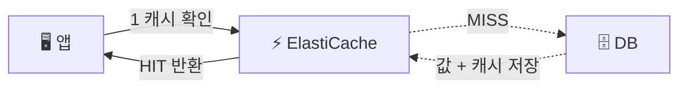
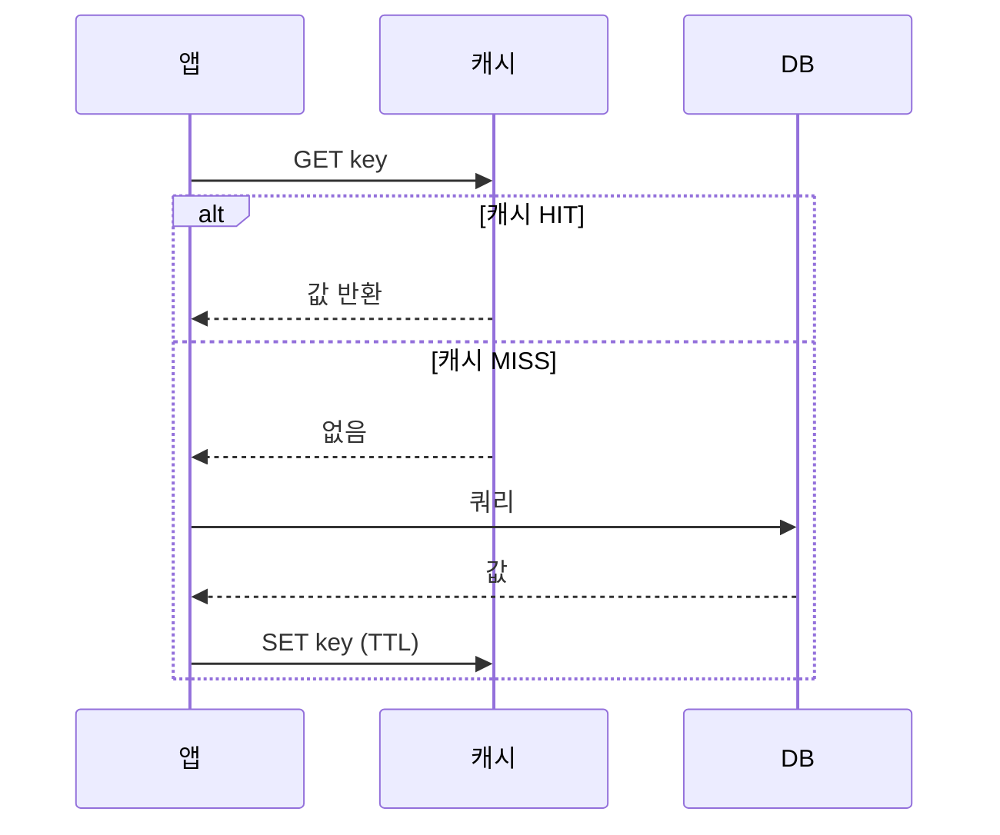

> **ElastiCache** → 관리형 **인메모리 캐시** (Redis / Memcached)
>
> 목적 → DB 앞에 두어 **부하 ⬇️ · 지연 ⬇️** (메모리라 마이크로초~ms)
>
> 핵심 → 자주 읽는 데이터를 메모리에 두고 **DB까지 안 가게**

---

## 한눈에

<Cards cols={3}>
<Card icon="⚡" title="인메모리">
디스크 아닌 RAM → 마이크로초~ms 응답
</Card>
<Card icon="🛡️" title="DB 보호">
반복 조회를 캐시가 흡수 → DB 부하 ⬇️
</Card>
<Card icon="🧩" title="Redis vs Memcached">
Redis(기능 풍부) vs Memcached(단순·빠름)
</Card>
<Card icon="🔄" title="Cache-Aside">
가장 흔한 패턴 · 앱이 캐시 먼저 확인
</Card>
<Card icon="⏰" title="TTL">
만료 시간 → 오래된 데이터 자동 제거
</Card>
<Card icon="🏆" title="활용">
세션·랭킹·rate limit·pub/sub
</Card>
</Cards>

---

## 1. 왜 캐시를 쓰나

- 같은 데이터를 **반복 조회** → 매번 DB 가면 느리고 부하 ⬆️
- 캐시(메모리)에 두면 → DB 안 거치고 즉시 응답

<Note type="success" title="효과">
- 읽기 지연 ms → 마이크로초
- DB 커넥션·쿼리 부담 대폭 ⬇️
- 트래픽 급증 시 DB 방패 역할
</Note>

---

## 2. Redis vs Memcached

<Compare>
<CompareCol title="🧰 Redis" subtitle="기능 풍부" color="pink">
- 다양한 자료구조 (string·list·set·sorted set·hash)
- 영속성(스냅샷/AOF) · 복제 · 자동 failover
- pub/sub · 트랜잭션 · Lua
- 대부분 Redis 선택
</CompareCol>
<CompareCol title="🪶 Memcached" subtitle="단순·멀티스레드" color="sky">
- 단순 키-값만
- 멀티스레드 → 단순 캐싱 처리량 ⬆️
- 영속성·복제 없음
- 순수 캐시만 필요할 때
</CompareCol>
</Compare>

<Note type="note" title="기본 선택">
- 세션·랭킹·pub/sub 등 기능 필요 → **Redis**
- 진짜 단순 캐시 + 수평 확장만 → Memcached
</Note>

---

## 3. 캐싱 패턴

**Cache-Aside (Lazy Loading)** — 가장 흔함:

- **Cache-Aside** → 앱이 캐시 먼저 보고, 없으면 DB 조회 후 캐시에 저장
- **Write-Through** → 쓸 때 DB + 캐시 **동시 갱신** (캐시 항상 최신, 쓰기 느림)
- **TTL** → 만료 시간 둬서 오래된 값 자동 제거

<Note type="warning" title="캐시 무효화">
- "캐시 무효화는 컴퓨터과학 2대 난제 중 하나"
- 데이터 바뀌면 → 캐시도 갱신/삭제 안 하면 **stale(낡은) 데이터**
- TTL + 쓰기 시 캐시 삭제(invalidate) 조합으로 관리
</Note>

---

## 4. Redis 활용 사례

| 사례 | 활용 자료구조/기능 |
|------|------|
| **세션 저장소** | string + TTL (로그인 세션) |
| **랭킹/리더보드** | sorted set (점수 정렬) |
| **Rate Limiting** | counter + TTL (요청 수 제한) |
| **실시간 메시징** | pub/sub |
| **분산 락** | SETNX (동시성 제어) |

---

## 5. 가용성

- **복제(Replication)** → 프라이머리 + 레플리카 → 읽기 분산·장애 대비
- **Multi-AZ + 자동 failover** → 프라이머리 죽으면 레플리카 승격
- **Cluster Mode** → 데이터를 **샤딩**해 여러 노드 분산 (대용량)

<Note type="note" title="RDS와 닮은 구조">
- 프라이머리/레플리카·Multi-AZ failover → [RDS](/devops/aws/storage/rds)와 개념 유사
</Note>

---

## 6. 실무 Tip

<Note type="pink" title="정리">
- 기본 패턴 → **Cache-Aside + TTL**
- 데이터 변경 시 → 캐시 **invalidate**(삭제) 잊지 말기
- **캐시 스탬피드** 주의 → 인기 키 동시 만료 → DB 폭주 → TTL 분산·락으로 완화
- 세션·랭킹·rate limit → Redis 자료구조 적극 활용
- 캐시는 **유실 가능 전제** → 원본은 항상 DB에
</Note>
