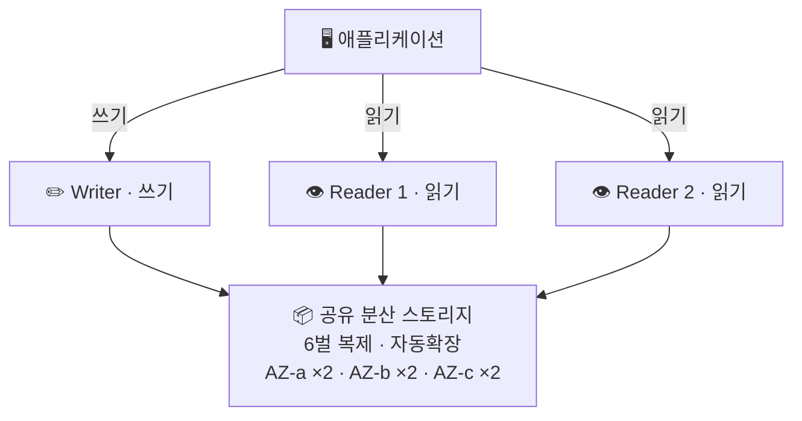
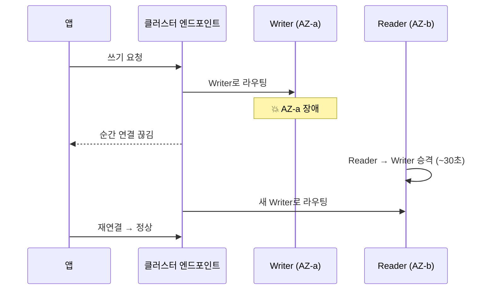

> **RDS** → AWS가 운영 대신 해주는 **관리형 관계형 DB**
>
> **Aurora** → RDS 위에서 도는 **AWS 자체 고성능 엔진** (MySQL · PostgreSQL 호환)
>
> 핵심 → **DB 운영의 귀찮은 일(백업·패치·복제·복구)을 AWS에 위임**

---

## 한눈에

<Cards cols={3}>
<Card icon="🗄️" title="RDS">
관리형 관계형 DB · 패치/백업/복제 자동
</Card>
<Card icon="🚀" title="Aurora">
AWS 자체 엔진 · 스토리지/컴퓨팅 분리 → 성능·확장 ⬆️
</Card>
<Card icon="🛡️" title="Multi-AZ">
다른 AZ에 **대기 복제본** · 장애 시 자동 전환 (가용성)
</Card>
<Card icon="👁️" title="Read Replica">
읽기 전용 복제본 · 읽기 트래픽 분산 (성능)
</Card>
<Card icon="🔌" title="엔드포인트">
접속 주소 · Writer / Reader / Cluster 역할 분리
</Card>
<Card icon="💾" title="백업">
자동 백업 · 스냅샷 · 시점 복구(PITR)
</Card>
</Cards>

---

## 1. RDS는 왜 쓰는가 — 직접 운영 vs 관리형

<Compare>
<CompareCol title="🖥️ EC2에 직접 설치" subtitle="셀프 매니지드" color="amber">
- OS·엔진 직접 설치/패치
- 백업 스크립트 직접 작성
- 복제·장애복구 직접 구성
- 자유도 최고 ⬆️ / 운영 인력 필요 ⬇️
</CompareCol>
<CompareCol title="🗄️ RDS (관리형)" subtitle="매니지드" color="green">
- 설치·패치 자동
- 백업·스냅샷 자동
- Multi-AZ·Read Replica 설정 한 번
- 운영 부담 ⬇️ / OS 접근 불가
</CompareCol>
</Compare>

<Note type="note" title="기억할 점">
- RDS → OS 레벨 접근 막힘
- 커널 튜닝·커스텀 플러그인 필요 → EC2 직접 운영 고려
</Note>

---

## 2. 지원 엔진과 Aurora의 위치

- RDS → 여러 엔진을 관리형으로 제공
- 그중 **Aurora만 AWS가 새로 만든 엔진**

| 엔진 | 설명 | 비고 |
|------|------|------|
| MySQL / MariaDB / PostgreSQL | 오픈소스 엔진 관리형 | 가장 일반적 |
| Oracle / SQL Server | 상용 엔진 | 라이선스 비용 ⬆️ |
| **Aurora (MySQL/PostgreSQL 호환)** | AWS가 클라우드용 재설계 | 성능·확장 특화 |

<Note type="success" title="Aurora 호환성">
- Aurora MySQL → 기존 MySQL과 드라이버·쿼리 호환
- 앱 코드 거의 안 바꾸고 이전 가능
</Note>

---

## 3. Aurora 핵심 — 컴퓨팅과 스토리지 분리

- 일반 DB → 한 서버에 **연산(쿼리)** + **저장(디스크)** 붙어 있음
- Aurora → 둘을 **분리**
  - **컴퓨팅** : Writer 1대 + Reader 여러 대
  - **스토리지** : 모두가 **공유**하는 분산 저장소

<Cards>
<Card icon="🔁" title="데이터 6벌 복제">
3개 AZ × 각 2벌 → 일부 깨져도 안전
</Card>
<Card icon="📈" title="스토리지 자동 확장">
용량 미리 지정 불필요 → 쓰는 만큼 10GB 단위 증가
</Card>
<Card icon="⚡" title="가벼운 복제본">
Reader가 같은 스토리지 공유 → 데이터 복사 없이 추가
</Card>
<Card icon="🔧" title="빠른 복구">
인스턴스 죽어도 스토리지 생존 → 복구 빠름
</Card>
</Cards>

<Note type="note" title="핵심 한 줄">
- 모든 인스턴스가 데이터를 각자 들지 않음
- 하나의 **공유 창고**를 같이 봄 → 복제본 추가·복구 빠름
</Note>

---

## 4. Multi-AZ vs Read Replica — 가장 헷갈림

- 이름 비슷 / **목적 정반대**

<Compare>
<CompareCol title="🛡️ Multi-AZ" subtitle="목적: 가용성(장애 대비)" color="sky">
- 다른 AZ에 **대기(standby)** 복제본
- 평소 접속 불가 (놀고 있음)
- 동기 복제 → 데이터 손실 거의 0
- Writer 장애 시 **자동 승격(failover)**
- "안 죽게" 만드는 장치
</CompareCol>
<CompareCol title="👁️ Read Replica" subtitle="목적: 성능(읽기 분산)" color="pink">
- 읽기 전용 복제본 (여러 개)
- **직접 접속해 읽기** 처리
- 비동기 복제 → 약간 지연
- 읽기 트래픽 분산
- "빠르게" 만드는 장치
</CompareCol>
</Compare>

<Note type="warning" title="자주 하는 실수">
- "Read Replica 두면 장애에 안전?" → ❌
- Read Replica → 읽기 분산용 · 자동 장애 전환 보장 ❌
- 가용성 목적 → **Multi-AZ**
- (Aurora는 Reader를 승격 대상으로 써서 경계 흐려짐 / 개념은 분리해 기억)
</Note>

---

## 5. 엔드포인트 — 어디로 접속하나

- Aurora 접속 주소 → 역할별 분리
- 앱은 역할에 맞는 엔드포인트로 접속

| 엔드포인트 | 가리키는 대상 | 용도 |
|------------|----------------|------|
| **Cluster (Writer)** | 현재 Writer 인스턴스 | 쓰기 (INSERT/UPDATE/DELETE) |
| **Reader** | Reader들에 자동 분산 | 읽기 (SELECT) 분산 |
| **Instance** | 특정 인스턴스 1개 | 디버깅·특정 노드 지정 |

<Note type="success" title="실무 팁">
- 읽기/쓰기 커넥션 분리
- 쓰기 → Cluster 엔드포인트 / 읽기 → Reader 엔드포인트
- Reader 추가만으로 읽기 성능 확장
</Note>

---

## 6. 장애 조치(Failover) — 죽으면 무슨 일이

- Writer 죽음 → Reader 하나를 Writer로 **승격**
- 보통 **30초 내외**

<Note type="note" title="왜 엔드포인트로 접속">
- 앱이 IP 아닌 **엔드포인트(이름)** 로 접속
- 내부 Writer 바뀌어도 앱 주소 변경 불필요 → 재연결만
</Note>

---

## 7. 백업과 복구

<Cards cols={3}>
<Card icon="🔄" title="자동 백업">
매일 자동 + 트랜잭션 로그 · 보존 1~35일
</Card>
<Card icon="📸" title="수동 스냅샷">
원하는 시점 직접 생성 · 지울 때까지 영구 보존
</Card>
<Card icon="⏱️" title="PITR (시점 복구)">
보존 기간 내 초 단위 시점 복구 · 실수 삭제 되돌리기
</Card>
</Cards>

<Note type="warning" title="주의">
- 복구 → 기존 DB 덮어쓰기 ❌ · **새 인스턴스로 복원**
- 복원 후 엔드포인트를 새 인스턴스로 전환 필요
</Note>

---

## 8. RDS vs Aurora — 뭘 쓰나

| 기준 | 일반 RDS (MySQL 등) | Aurora |
|------|---------------------|--------|
| 성능 | 표준 | 높음 (MySQL 대비 수 배) |
| 스토리지 | 용량 미리 지정 | 자동 확장 |
| 복제본 추가 | 느린 편 | 빠름 (공유 스토리지) |
| 비용 | 저렴 | 약간 높음 |
| 적합 | 소규모·비용 민감 | 트래픽 많고 확장 필요 |

<Note type="pink" title="실무 정리 (Aurora MySQL)">
- 읽기 많음 → Reader 엔드포인트 + Read Replica로 분산
- 가용성 필수 → Multi-AZ (Reader가 곧 failover 대상)
- 비용 최적화 → 트래픽 변동 크면 **Aurora Serverless v2** 자동 스케일
- 앱 → 항상 IP 아닌 **엔드포인트 접속** → failover 무중단
</Note>
