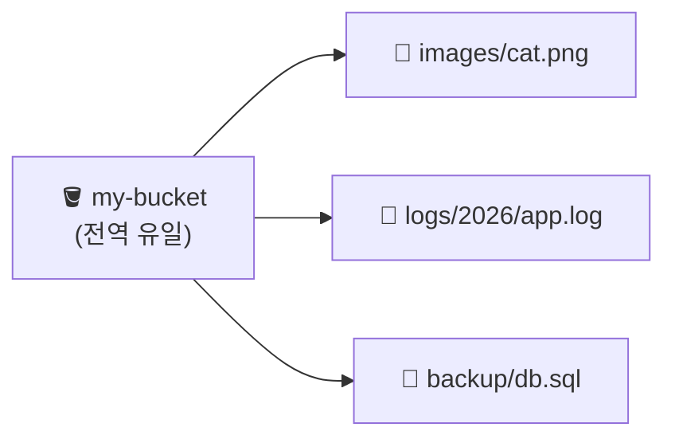
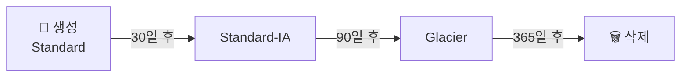

> **S3(Simple Storage Service)** → 파일을 **객체(object)** 단위로 무한히 저장하는 스토리지
>
> 디스크(블록)도 파일시스템도 아닌 **객체 스토리지** → HTTP API로 넣고 꺼냄
>
> 내구성 **99.999999999%(11 9s)** → 사실상 안 잃어버림

---

## 한눈에

<Cards cols={3}>
<Card icon="🪣" title="버킷(Bucket)">
객체를 담는 최상위 컨테이너 · 이름은 **전역 유일**
</Card>
<Card icon="📄" title="객체(Object)">
저장 단위 = 데이터 + 메타데이터 + **키(Key)**
</Card>
<Card icon="🗂️" title="키(Key)">
객체 경로(이름) · `폴더`는 없고 **prefix로 흉내**
</Card>
<Card icon="🧊" title="스토리지 클래스">
접근 빈도별 요금 차등 · Standard ~ Glacier
</Card>
<Card icon="♻️" title="라이프사이클">
오래된 객체 자동 이동/삭제 → 비용 ⬇️
</Card>
<Card icon="🔒" title="보안">
기본 비공개 · 버킷 정책 · 암호화 · presigned URL
</Card>
</Cards>

---

## 1. 객체 스토리지란 — 블록/파일과 뭐가 다른가

<Compare>
<CompareCol title="💽 블록(EBS) · 파일(EFS)" subtitle="디스크처럼" color="amber">
- 서버에 마운트해서 사용
- 디렉터리·파일 구조 그대로
- 일부만 수정 가능 (랜덤 R/W)
- 용량 한계 / 단일 AZ·리전 결합
</CompareCol>
<CompareCol title="🪣 객체(S3)" subtitle="HTTP API로" color="green">
- 마운트 X · **API로 PUT/GET**
- 평평한 키 공간 (폴더 없음)
- 객체는 **통째로** 교체 (부분 수정 X)
- 용량 무제한 · 11 9s 내구성
</CompareCol>
</Compare>

<Note type="note" title="언제 S3">
- 이미지·동영상·로그·백업·정적 파일·데이터 레이크
- DB 데이터나 OS 디스크 → S3 ❌ (그건 EBS/RDS)
</Note>

---

## 2. 버킷 · 객체 · 키

- **버킷** → 객체를 담는 통 · 이름 **전 세계 유일** · 리전에 속함
- **객체** → 데이터 + 메타데이터 + **키**
- **키** → 객체의 전체 이름 (`logs/2026/06/app.log`)
  - S3엔 폴더 개념 없음 → 키의 `/`로 **폴더처럼 보이게** (prefix)

<Note type="success" title="강한 일관성">
- S3는 **read-after-write 강한 일관성** (2020년~)
- PUT 직후 GET → 항상 최신 (예전엔 결과적 일관성이라 헷갈렸음)
</Note>

---

## 3. 스토리지 클래스 — 접근 빈도 ↔ 비용

- 핵심 트레이드오프 → **저장 비용 ⬇️ = 꺼낼 때 비용·지연 ⬆️**

| 클래스 | 용도 | 특징 |
|------|------|------|
| **Standard** | 자주 접근 | 비싸지만 즉시·저지연 |
| **Intelligent-Tiering** | 패턴 모름 | 접근 빈도 보고 **자동 이동** |
| **Standard-IA** | 가끔 접근 | 저장 ⬇️ / 꺼낼 때 요금 |
| **One Zone-IA** | 재생성 가능 | 단일 AZ → 더 쌈 (내구성 ⬇️) |
| **Glacier Instant** | 아카이브+즉시 | 분기 1회 접근급 |
| **Glacier Flexible / Deep Archive** | 장기 보관 | 가장 쌈 / 꺼내는 데 분~시간 |

<Note type="warning" title="주의">
- IA·Glacier → **꺼낼 때(retrieval) 요금** 발생
- 자주 읽는데 IA 두면 오히려 비쌈 → 접근 패턴 확인 필수
</Note>

---

## 4. 라이프사이클 — 자동으로 이동·삭제

- 객체는 시간 지나면 **덜 중요** → 자동으로 싼 클래스로 이동 or 삭제
- **Transition**(클래스 이동) + **Expiration**(삭제) 규칙

<Note type="pink" title="실무 예">
- 로그 → 30일 Standard → 90일 IA → 1년 Glacier → 그 후 삭제
- 비용 자동 최적화 → 손 안 댐
</Note>

---

## 5. 보안 — 기본은 "전부 비공개"

- S3 객체 → **기본 비공개** (공개하려면 명시적 설정)
- 접근 제어 수단:

| 수단 | 설명 |
|------|------|
| **Block Public Access** | 계정/버킷 단위 공개 전면 차단 (기본 ON) |
| **버킷 정책** | JSON으로 버킷 단위 권한 (누가·어떤 작업) |
| **IAM 정책** | 사용자/역할 단위 권한 |
| **Presigned URL** | 임시 서명 URL → 잠깐만 접근 허용 |
| **ACL** | (레거시) 객체별 권한 · 지금은 비권장 |

<Note type="danger" title="가장 흔한 사고">
- 버킷 실수로 **퍼블릭** → 데이터 유출
- → **Block Public Access 항상 ON** 유지 + 공유는 **presigned URL**로
</Note>

**암호화** (기본 적용됨):
- **SSE-S3** → S3 관리 키 (기본)
- **SSE-KMS** → KMS 키 (감사·권한 제어 ⬆️)
- **SSE-C / 클라이언트 암호화** → 키를 직접 관리

---

## 6. 버전 관리 (Versioning)

- 같은 키에 다시 PUT → 덮어쓰기 대신 **이전 버전 보존**
- 실수 삭제·덮어쓰기 복구 가능
- 단점 → 버전 쌓이면 **저장 비용 ⬆️** → 라이프사이클로 옛 버전 정리

<Note type="note" title="MFA Delete">
- 버전 영구 삭제 시 MFA 요구 설정 가능 → 실수·악의 삭제 방어
</Note>

---

## 7. 실무 Tip

<Note type="pink" title="정리">
- 정적 사이트·이미지 → **S3 + CloudFront(CDN)** 로 캐싱·가속
- 대용량 업로드 → **Multipart Upload** (분할 병렬)
- 비용 → 접근 패턴 모르면 **Intelligent-Tiering**, 알면 라이프사이클 직접
- 보안 → Block Public Access ON + presigned URL + SSE-KMS
- 데이터 레이크 → S3 + Athena/Glue로 쿼리
</Note>
